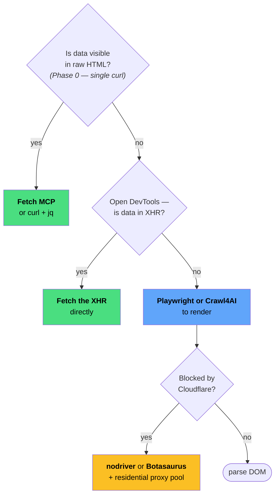
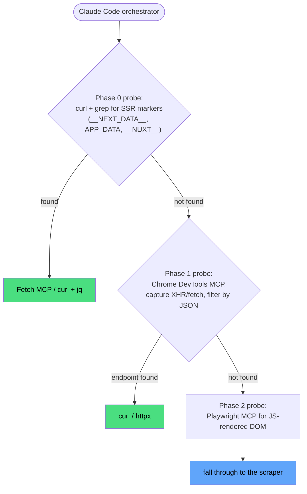

# Crawling the Web with an LLM in the Room

*A share-and-learn deep dive into how modern web crawling actually works in 2026, where LLMs help, and where they don't — backed by a six-round benchmark across Cloudflare Turnstile, application-layer retail, and DataDome / Kasada / Akamai. Companion deck: `slides.md`.*

**Author:** hainm
**Date:** 2026-04-22
**Read time:** ~40 min full · ~10 min skim (Part 1 + Part 7).
**Reproducibility:** every claim anchors to a dated scorecard and a re-runnable command — see Appendix A.

---

## 0. Why this essay exists

Every other week there's a new viral post: *"LLMs can scrape anything now!"* Usually with a flashy demo against some cooperative website and a tagline about how scraping is a solved problem. I wanted to believe it. Then I tried it against real targets, and no — the narrative is wrong because it leaves things out.

Crawling has been a discipline for thirty years. Most of the hard parts — politeness, legal exposure, schema drift, anti-bot back-and-forth — aren't the parts an LLM solves. The parts LLMs *do* help with (deciding *where* the data lives, writing the glue code, escalating wisely when the first attempt fails) are trickier than the marketing admits.

So this essay is for us — engineers on the team who can write Python, have shipped a scraper that surprised us, have watched someone demo a fancy tool and wondered whether it actually generalises, and want an honest answer before committing a pipeline to production.

Every claim below comes from a run in this repo. Not from a marketing blog.

---

## Part 1 — The Thesis

A thesis is a methodology, an evidence-backed ceiling, and an honest escalation rule — wrapped together. Ours lives in the repo at `.claude/skills/crawl-thesis/` so any teammate can apply it without re-reading this essay (companion sub-agent: `crawl-specialist` · slash command: `/crawl`). What follows is the human-readable version — read this once, then use the skill.

### 1.1 The thesis in one sentence

Condensed into a single claim we're willing to defend:

> **Free/local tools clear everything up to Cloudflare-managed challenges. DataDome, Kasada, Akamai Bot Manager, and application-layer signatures (Shopee-class) require Tier-C paid infrastructure or a business relationship — not a better tool.**

That's the whole argument. The rest of the essay is evidence, details, and what to do with it.

#### The four tiers (referenced throughout this essay)

Every escalation decision maps onto one of these:

| Tier | What it is | Cost | Verdict |
|---|---|---|---|
| **A** | Plain HTTP — Scrapy / httpx / curl / Scrapling `Fetcher` | free · bandwidth only | Polite public data, documented APIs, SSR (Server-Side Rendered) blobs |
| **B** | Free + CF-specific stealth — Scrapling `StealthyFetcher(solve_cloudflare=True)` | free · ~20 s solve | Cloudflare managed / Turnstile (sandbox + real production) |
| **C** | Paid — residential proxy pool ± vendor API (Scrapfly / ZenRows / Bright Data / Zyte / Oxylabs) | ~$30-500/month | DataDome · Kasada · Akamai · application-layer |
| **D** | Sanctioned — Cloudflare AI `/crawl` endpoint (2026-03) | per-request quota | Only when the target has opted into AI Crawl Control |

#### Quickstart for the impatient reader

| Time budget | Read |
|---|---|
| **5 min** | §1.1 (this) · §1.4 decision tree · §1.5 calibrated ceiling |
| **10 min** | + §5.2 the round where the ceiling moves |
| **20 min** | + Part 7 the stack we'd actually deploy |
| **40 min** | the whole thing — Part 2 discipline through Part 8 closing |

### 1.2 The four layers the thesis composes

1. **Methodology** — phased reconnaissance from `yfe404/web-scraper`, sharpened across nine rounds.
2. **Framework** — Scrapy for recurrent pipelines (`ROBOTSTXT_OBEY`, `AUTOTHROTTLE`, `FEEDS`, `Items`, `Pipelines` as defaults).
3. **Specialty tools** — right instrument per protection class: **Scrapling** fetcher library (`Fetcher`/`DynamicFetcher`/`StealthyFetcher`; full spotlight §3.2), `curl_cffi` (TLS-impersonating HTTP client), `nodriver` (stealth Chromium successor to `undetected-chromedriver`), Botasaurus (all-in-one anti-bot framework).
4. **LLM orchestration** — Claude runs the loop: reason → probe → decide → act → validate → document.

The combination, not any one layer, produces honest re-runnable crawls.

### 1.3 The workflow — required order

*Naming note: "Phase 0-5" below is the **execution workflow** — the steps we actually run on a crawl. The **six lifecycle phases** in §2.2 (Scope · Research · Discovery · Extract · Validate · Scale & Persist) are conceptual categories. Related but not identical — we'd have picked different words if doing it over.*

**Phase 0 — curl probe (≤ 60 s, no browser):**

```bash
curl -sI -A "Mozilla/5.0" "<target>"                    # headers — what protection class?
curl -s  -A "Mozilla/5.0" "<target>" | head -c 2000     # body — is data in raw HTML?
curl -s  "<target>/robots.txt"                          # politeness baseline
```

**Quality Gate A** — the critical one:
- Target fields in raw HTML, OR documented API surfaces them → **skip Phase 1/2**, jump to Phase 3 with plain HTTP.
- Otherwise → continue to Phase 1.

This gate saves ~80 % of work on polite sites (R1, R2, R4 confirm).

**Phase 1 — browser recon** (only if Gate A fails). Right tool for the observed class; subscribe `page.on('request')` *before* navigation; for aggressive anti-bot, warm the session via homepage-first in the same context.

**Phase 2 — interactive exploration** (only if Phase 1 is not enough). Scroll, "load more", trigger lazy XHRs.

**Phase 3 — extract + validate.** Row count meets target · all required fields non-empty · anchor check · unique primary keys · cross-source sanity when available.

**Phase 4 — honest escalation when blocked.** Don't keep trying blindly. Map failure mode → response:
- Still "Just a moment..." after `StealthyFetcher` → fresh IP, or accept this one is flagged.
- DataDome full CAPTCHA · Kasada `ips.js` · Akamai `_abck` → **stop. Tier C.**
- Silent `/login` redirect → try homepage warming; else Tier C.

**Phase 5 — `mechanism.md`**, six sections: L1 Research · L2 Discovery · L3 Validation · L4 Scaling · L5 Persistence · L6 Adversarial. Honest failure with captured error codes beats any cherry-picked screenshot (R3, R5, R6 all proved this).

### 1.4 The decision tree

Walking the tree maps a target onto one of the four tiers defined at §1.1:

```
Q1: Is target data in raw HTML / SSR / public API?
  YES → plain HTTP. Tier A.
  NO  → continue.

Q2: What class of anti-bot fires?
  Cloudflare managed / Turnstile → Scrapling StealthyFetcher(solve_cloudflare=True). Tier B.
                                   ✓ R3 sandbox · R5-v1 · R7 real production.
  DataDome                       → stop. Tier C. ✗ R8 G2.
  Kasada v3                      → stop. Tier C (no free POW solver anywhere). ✗ R8 Hyatt.
  Akamai Bot Manager             → try curl_cffi safari18_0 first; else Tier C. ✗ R8 Lowe's.
  App-layer silent /login        → homepage-warming; else Tier C. ✗ R5 Shopee.

Q3: One-shot or recurrent pipeline?
  One-shot   → plain httpx / Scrapling Fetcher / curl + jq.
  Recurrent  → Scrapy project (AutoThrottle, FEEDS, Items, Pipelines).
```

### 1.5 The calibrated ceiling

Evidence-backed, not marketing. Eight rounds in §5 corroborate every row:

| Protection class | Free-tier verdict | Evidence |
|---|---|---|
| Polite public data · documented API · SSR blob | ✅ clear | R1 CMC · R2 Binance · R4 ecommerce · R6 Substack — Scrapling `Fetcher`, sub-second to ~30 s |
| Cloudflare managed / Turnstile (sandbox + real production) | ✅ clear | R3 scrapingcourse · R5-v1 (preliminary Scrapling-only pass on the CF sandbox) · R7 BlackHatWorld (BHW) — `StealthyFetcher(solve_cloudflare=True)`, ~20 s |
| Application-layer (session + device + behavioural) | ❌ blocked | R5 Shopee — silent login redirect, 14-cookie warm session still 403 |
| DataDome · Kasada v3 · Akamai Bot Manager | ❌ blocked | R8 G2 · Hyatt · Lowe's — three independent failure modes |
| Any of the above with a datacenter-ISP proxy pool | ❌ same or worse | Proxy flips failure *mode*, not *result*; Akamai actually worse with bad-ASN |

### 1.6 Ethics, automated

Operational safe defaults baked into the thesis so they can't be forgotten:

- `robots.txt` honoured (`ROBOTSTXT_OBEY=True`)
- UA identifies the crawler with a contact (`"<project>-research (contact@example.com)"`)
- ≤ 5 fetches per domain per one-shot; `AUTOTHROTTLE` for recurrent; ≥ 10 s between retries
- No login, no auth, no personal data, no republishing

### 1.7 The required outputs

Every crawl run produces the same six files, regardless of outcome:

| File | Contents |
|---|---|
| `result.json` | Array of typed objects — or `[]` with honest explanation |
| `result.csv` | Same data, header + rows |
| `script.py` / `extract.py` | Re-runnable driver |
| `page.html` | Final fetched body (success or challenge page) |
| `xhr_log.json` | If any browser tier ran |
| `mechanism.md` | L1..L6 intelligence report |

Honest `[]` with evidence is the correct output when a target exceeds our Tier. Making up rows is forbidden. The thesis *is* the discipline of stopping.

---

**The rest is the evidence.**

---

## Part 2 — Crawling as a Discipline

### 2.1 A tiny bit of history

It helps to remember this problem has been evolving for thirty years before we showed up.

WebCrawler (1994) was the first bot that followed hyperlinks for a real search engine. That same year Martijn Koster proposed `robots.txt` — basically a polite "please don't" note for bots — which became the social contract and eventually **[RFC 9309](https://www.rfc-editor.org/rfc/rfc9309.html)** in 2022. Google-scale infrastructure made crawling a commodity in the 2000s. And today? We're in the **adversarial era** — Cloudflare, Akamai, DataDome, JA3/JA4 fingerprinting, Turnstile, *hiQ v LinkedIn*. Every capability has a counter-measure; every counter-measure has a counter-counter-measure. That's the game.

**Takeaway:** don't assume today's best trick survives six months. And keep "how we fetch" separate from "what we parse" — fetchers churn, parsers shouldn't.

### 2.2 The six-phase crawl lifecycle

Naming the phases helps when debugging *why* a scraper failed. The table below is the **canonical lifecycle reference** — Phase numbers are stable across the rest of the essay, including the tool mapping in Part 3:

| # | Phase | Question answered | Best free/local tool in 2026 |
|---|---|---|---|
| **1** | Scope | What field, what row, what freshness, what cost ceiling? | The LLM itself — good at asking *"what do we actually need?"* |
| **2** | Research | Who owns the data? Public API? robots.txt says what? Legal line? | `WebSearch` + `WebFetch` + docs. Skill pattern: `yfe404/web-scraper` Phase-0 curl assessment. |
| **3** | Discovery | *Where does the data live* — SSR HTML, XHR, GraphQL, WebSocket, JS-rendered DOM, `__NEXT_DATA__` blob? | `Chrome DevTools MCP` (Model Context Protocol). Fallback: `Playwright MCP` `page.on('request')`. |
| **4** | Extract | HTTP call + parse → structured rows | Plain HTTP (Fetch MCP / `curl_cffi`) if API exists. Browser (`Playwright` / `Crawl4AI`) if SPA. Framework once the project runs longer than a week. |
| **5** | Validate | Schema, field types, freshness, cross-source sanity | `Item` + validators + Pydantic. Cross-source anchor (e.g. CoinGecko vs CMC). |
| **6** | Scale & Persist | Pagination, concurrency, retries, dedup, persistence, backfill | Framework defaults (`AutoThrottle`, `RETRY_TIMES`, `FEEDS`, `ROBOTSTXT_OBEY`). Adversarial: `nodriver`, Botasaurus, **Scrapling**, residential proxies. |

Costly traps: skipping Research (the API existed), collapsing Discovery into Extract (data was in an XHR), treating Scale as a v3 problem. §2.6 picks up Phase 6 in detail. **No single tool covers all six phases — we assemble a stack** (and §3.2 below spotlights the standout, Scrapling).

### 2.3 The adversarial layer: what websites fight back with

Five classes of defence, layered. A tuned bot manager uses *every* signal.

| Layer | What it scores | Free-tier counter |
|---|---|---|
| **robots.txt / ToS** | Voluntary compliance · good-faith evidence | `ROBOTSTXT_OBEY=True` (Scrapy) |
| **IP reputation** | ASN (Autonomous System Number) · subnet age · behaviour across *all* CF customers; datacenter starts suspect | Residential / mobile proxy pool (Tier C, §3.3) |
| **TLS / HTTP-2 fingerprint (JA3, JA4)** | Cipher order, extensions, ALPN — `requests` instantly recognisable | `curl_cffi` / Scrapling `Fetcher` |
| **Browser fingerprint** | `navigator.webdriver` · Canvas · WebGL · AudioContext · fonts · input timing | `camoufox` (stealth-patched Firefox) · `patchright` · `StealthyFetcher` · `nodriver` |
| **JS challenge / CAPTCHA** | `cf_clearance` cookie after crypto/canvas/WebGL probes | `StealthyFetcher(solve_cloudflare=True)` for CF · paid solver for DataDome/hCaptcha |

**The 2026 reality** (Round 3 evidence): on a datacenter IP, *generalist* free tools can't bypass Cloudflare managed — the bot manager combines all five layers and flags the IP before the challenge iframe mounts. One specialist free tool (Scrapling) *does* bypass it; everything harder (DataDome / Kasada / Akamai / app-layer) needs Tier C.

### 2.4 Ethics + law

Three axes:

- **US / CFAA** — *[hiQ v LinkedIn](https://en.wikipedia.org/wiki/HiQ_Labs_v._LinkedIn)* (9th Cir. 2019-2022): scraping *public* data is not unauthorised access. Narrow but foundational. hiQ still settled with damages under other claims — treat it as a floor, not a shield.
- **EU / GDPR** — public ≠ fair game for personal data. French CNIL fined **KASPR €240,000** for LinkedIn scraping despite profiles being publicly visible.
- **Contract + copyright** — ToS survives *hiQ* independently; copyright applies to editorial content (facts are uncopyrightable).

**Operational safe defaults:** honour `robots.txt` · UA with contact · ≤1 req/s per host · prefer official API · no personal data without lawful basis. If all predicates hold, we are probably fine. We are not lawyers — for anything grey, ask one. The rest of this essay assumes that call is made separately.

### 2.5 The operational worries — a single checklist to pin

**Production crawls fail quietly far more often than they fail loudly.** Schema drift, silent 200, partial UA ban — none page the engineer; all corrupt the dataset. One checklist a team lead can pin:

- ☐ **Politeness drift** — `AUTOTHROTTLE` on, per-domain concurrency capped, UA with contact. "concurrency=100 for tonight" forgotten = banned IP range.
- ☐ **Ethics baked in** — `robots.txt` honoured, rate limit respected, ≥ 10 s between retries.
- ☐ **Discovery done** — Network tab, SSR grep, `__NEXT_DATA__` search done at least once? Or is the browser running on reflex?
- ☐ **Fetch layer honest** — TLS fingerprint realistic, JS engine actually needed?
- ☐ **Schema drift caught** — every field typed, null/empty validators on every row. Items + Pipelines catch silently-added columns on day one.
- ☐ **Freshness observed** — timestamp per row, rows-per-minute, CF-challenge ratio per host. Late data is an outage, not a blip.
- ☐ **Dedup working** — primary keys can't collide; "next page" poisoning caught by `dupefilter`, not guessed.
- ☐ **Silent-200 caught** — 200 with empty body / maintenance page = parser sees 0 rows, monitor counts success. Plausibility check on every response.
- ☐ **Partial bans noticed** — UA throttled to 1 req/s silently (no 429); budget + throughput assertion catches it.
- ☐ **Persist idempotent** — JSON + CSV + optional Parquet/DB. Re-runs overwrite cleanly.

Every row *yes, with evidence* = likely production-grade. If not, the LLM isn't the missing piece — the discipline is.

### 2.6 Scale — the problem that only shows up at 100× URLs

**A scraper that works on 10 URLs and breaks at 10,000 is not a bug — it's a category difference.** The pipeline that runs nightly for a year against 50,000 URLs without paging a human at 3 am is the hard part. Five dimensions need answers before first production, not after.

**1 · URL management.** At 100k URLs we need a priority queue (new/stale/high-value first), persistent primary-key dedup across runs, frontier management with expiry rules, and idempotent retry with exponential backoff. Single worker: Scrapy `dupefilter` + `JOBDIR`. Multi-worker: external queue — Redis (`scrapy-redis`), Prefect, Celery, or Postgres `SELECT FOR UPDATE SKIP LOCKED`.

**2 · Rate budgeting per domain.** Ten workers each running their own `AUTOTHROTTLE` will still hammer one site — throttle is per-worker, not per-domain. Need a **global politeness budget per target** (e.g. 2 req/s to `shopee.sg`), adaptive throttle reacting to 429/503/CF-challenge ratios, and per-host circuit breakers (5 min cooldown on CF-flood). Tools: `scrapy-redis` cluster-aware throttles, Prefect rate-limit primitives, or a leaky-bucket on the shared queue.

**3 · Proxy + session scaling.** At 10 workers on 500 IPs, we need sticky sessions (route target *Y* to IP *X* once warmed), session-age tracking with homepage-warm on rotation, per-IP request budgets (~100 req/IP/target then rotate), and anti-detect browser profile pools when fingerprinting fires (Multilogin / GPM / AdsPower expose local HTTP ports for this).

**4 · Storage at volume.** JSON + CSV is fine at 1k rows; at 10M we need partitioned Parquet (`s3://bucket/<target>/year=YYYY/month=MM/day=DD/*.parquet`) for cheap time-range queries + idempotent re-runs, schema-hash per partition for drift detection, and cost-of-bytes modelling — a browser per page is 500 KB-2 MB vs 20 KB for a JSON call (100× egress at 100k URLs).

**5 · Observability — the metrics that catch silent failures.** Silent-200, schema drift, partial ban all look "fine" on vanilla runs. Production needs: `rows_extracted` per target trended (not just "did the run succeed"), `fetched_at` per row + `p95_freshness` per target, CF-challenge ratio per host (catch creeping 0→30 % before 100 %), schema-drift alarms (this week's field set vs last week's), budget-vs-actual per run (5,000 requests budgeted, 50,000 actual = pagination poisoning).

None of this is scraping-specific; it's the minimum bar for any recurrent data pipeline. The LLM can wire it up but humans set the thresholds and own the pager. *Part 7 maps these to a concrete stack.*

---

## Part 3 — The Tool Ecosystem

### 3.1 Tools evolve daily; so does anti-bot

Picking and combining tools is most of the work. The LLM makes that work faster; it does not change what the tools underneath are doing. Two things to keep in mind before the mapping below:

- **The tool landscape moves fast.** Scrapling earned its spotlight in 2026 by clearing Cloudflare-managed challenges out of the box; the crown may change hands by 2027. Everything here is a dated snapshot.
- **Anti-bot moves faster.** Detection signals ship weekly. **No tool is absolute.** The question is never *"which tool wins?"* but *"which tool matches this target's protection class, today?"* — and *"how will we notice when that match breaks?"*

### 3.2 Spotlight — Scrapling

The phase-by-phase tool mapping lives in the §2.2 lifecycle table (combined with the phase definitions there — one canonical place, not two). The standout tool deserves its own callout.

Okay, quick aside, because this one deserves it. [**Scrapling**](https://github.com/D4Vinci/Scrapling) (BSD-3) was the biggest surprise of the benchmark — by some margin, the single most powerful free/local anti-bot tool we tested. Three fetchers, one API:

- **`Fetcher`** — TLS-impersonating HTTP (curl_cffi-backed). JA3/JA4 spoof + HTTP/2 built in.
- **`DynamicFetcher`** — Playwright/Chromium for JS-rendered pages.
- **`StealthyFetcher`** — Camoufox + humanisation + the killer kwarg `solve_cloudflare=True`. Clears CF-managed challenges in ~20 s. Sandbox ✓ (R3, R5-v1) and real production ✓ (R7).

Plus adaptive selectors, a built-in MCP server, session primitives, streaming async, a CLI. **No other free library in 2026 matches the CF-managed bypass out of the box.** (And yes, we tried them all — see R3.) Ceiling is still real: DataDome / Kasada / Akamai / app-layer require Tier-C (R8-R9).

If we install one thing, make it Scrapling. Then re-benchmark next quarter — because §3.1 applies to Scrapling too; crowns move fast in this space.

### 3.3 The infrastructure layer — proxies and anti-detect browsers

Software tools are half the stack; **where the request appears to come from, and what browser appears to make it**, are the other half. Serious scraping budgets usually spend more on this layer than on code.

#### Proxies — why they exist and which tier to buy

Bot managers score every request by **IP reputation** — an combined score over ASN, subnet age, historical behaviour, and the reputation its *neighbours* earned. A datacenter IP starts suspect no matter what headers we send. A proxy exists to relocate the request to an IP that starts trusted. Four tiers, increasingly trusted and expensive:

| Tier | What it really is | Trust | ~$/GB | Right fit |
|---|---|---|---|---|
| **Datacenter** | Commercial IP ranges (AWS, GCP, Hetzner) | Lowest | ~$1 | Polite targets · high throughput · any site where IP reputation isn't scored |
| **ISP / static residential** | IPs assigned by real ISPs but hosted in a datacenter | Mid-high | ~$3-5 | Logged-in session stickiness · long-running jobs with the same identity |
| **Residential** | Real home IPs, rented via SDK-in-consumer-apps schemes (ethics complicated) | High | ~$3-8 | Cloudflare / DataDome / Akamai targets that score IP reputation hard |
| **Mobile (4G/5G)** | Cellular carrier NAT — hundreds of real phones share one IP | Highest | ~$7-15 | The most aggressive targets; mobile-native sites |

Providers: [Bright Data](https://brightdata.com/) · [Smartproxy](https://smartproxy.com/) · [Oxylabs](https://oxylabs.io/) · [NetNut](https://netnut.io/) · [IPRoyal](https://iproyal.com/) · [Soax](https://soax.com/).

**Trap: price band ≠ trust.** The proxy-variance test in §5.7 rented a pool marketed as "ISP-class" and discovered the provider's ranges were already on Akamai's bad-ASN list — paying more made Akamai *worse*, not better. Buy the class the specific target's bot manager actually scores, not the cheapest tier with a residential-sounding label.

#### Anti-detect browsers — why they exist and when they're worth it

Bot managers score the **browser fingerprint**: Canvas, WebGL, fonts, WebRTC, HTTP/2 settings, timezone/locale. An anti-detect browser is a Chromium fork that generates a coherent fake fingerprint *per profile* and runs many profiles in parallel.

| Tool | Pitch |
|---|---|
| [**Multilogin**](https://multilogin.com/) | Gold standard · ~$99+/mo · enterprise, team collab |
| [**GoLogin**](https://gologin.com/) | Free tier · budget · entry point |
| [**Kameleo**](https://kameleo.io/) | Mobile fingerprint specialist · iOS/Android |
| [**AdsPower**](https://www.adspower.com/) | 🇨🇳 e-commerce + ads · automation API |
| [**Dolphin Anty**](https://dolphin-anty.com/) | Affiliate marketing · 100s of accounts |
| [**GPM Login**](https://gpmlogin.com/) | 🇻🇳 one-time lifetime licence · VN MMO community |
| Undetectable / Morelogin / VMLogin / IncogniTon | Regional variants |

**Buy** when the team already runs many profiles for multi-account ops — plug the scraper into the local HTTP-proxy port and reuse the fingerprint pool. **Skip** for scraping-only use; `Scrapling.StealthyFetcher` and `nodriver` do programmatic per-request stealth, fit CI/CD, cost nothing per profile.

**Rule of thumb:** proxies solve *where the request comes from*; anti-detect browsers solve *what the browser looks like*. Hard targets want both. Scrapling clears CF-managed with programmatic stealth alone on a clean IP — no browser needed.

### 3.4 A decision tree for "which tool do we pick first?"



Five minutes to walk down. Most pages answer "yes" at step 1 or 2.

---

## Part 4 — Enter the LLM

### 4.1 What LLMs actually add to crawling

Four things, well. Beyond these, not really:

1. **Reasoning about *where* the data lives.** Point an LLM at a Next.js page, and it'll spot the `__NEXT_DATA__` blob and generate the right `json.loads(...)[...]` path in one round-trip. With a junior engineer + DevTools, that's 10-20 minutes of clicking and swearing. **The single biggest productivity gain** — and frankly the thing that justifies the whole "LLM in the loop" framing.

2. **Gluing the boring parts.** Config files, CSV exporters, Pydantic models, small CLIs — the 80 % of scraping code that isn't interesting-to-write. An LLM writes this faster than any human, and usually more correctly.

3. **Escalation when the first attempt fails.** Plain-HTTP returns 403 → the LLM recognises the CF interstitial, reads the response headers, proposes the next rung (real browser, TLS impersonation, stealth). It doesn't magically succeed. But it cuts debug time from hours to minutes.

4. **Documentation.** The run ends and the LLM writes a coherent *what I did / what worked / what didn't / what I'd try next* narrative — immediately useful to the next engineer who touches this. R3's six `mechanism.md` files are the artefact: every tool failed, and every failure report is still useful.

### 4.2 What LLMs do *not* add

Equally important — a short list of things the LLM keeps pretending to solve and doesn't:

1. **Cloudflare bypass magic.** R3 shows six anti-bot tools under LLM orchestration, all failing on the same datacenter IP. Orchestration doesn't change IP-reputation reality underneath.
2. **Ethics judgement.** The LLM will happily scrape a site whose ToS forbids it. The legal/ethics call stays with us — and this can't be delegated.
3. **Schema-drift detection across weeks.** LLMs don't remember between runs. They can propose validators, sure — but they won't notice that last week's schema had 6 fields and this week's has 7.
4. **Cost control.** Real browser per page is expensive. LLMs don't volunteer to fall back to cheap HTTP when the response is parseable that way. Build that escalation explicitly.
5. **Proxy management.** The LLM configures proxies; it doesn't procure them, rotate them intelligently, or pay for them.

**Honest framing:** LLMs accelerate discovery + glue + debug by 3-10×. They leave legal, policy, proxy, and observability work unchanged. And they don't help at all with the hardest adversarial targets — those are economic problems, not algorithmic ones.

---

## Part 5 — The Benchmark Rounds

### 5.1 Methodology + master scorecard

**Every round runs the same triangle: Claude Code (orchestrator) → the `crawl-thesis` skill (methodology) → the actual tool (Scrapling / Scrapy / curl_cffi / etc.).** Concretely: I (the orchestrator) define a task and a rubric, then spawn a fresh Claude Code sub-agent per tool — fresh context, no memory of earlier rounds. That sub-agent reads the thesis skill, follows its workflow (Phase 0 → Gate A → escalate), picks the right tool per the skill's decision tree, runs the extraction, and writes a `mechanism.md` self-report. I auto-score the result and publish the scorecard.

Fresh sub-agents matter: I had already discovered data paths from earlier rounds; if I drove the tools myself the "discovery" dimension would be polluted. The skill + sub-agent design forces every round to *re-derive* the answer from headers and body — same way a teammate would on a new target.

R1-R4 were each run **twice** — once tool-diversity (different tools per agent, ranked), once Scrapling-only (same target, one library) — verifying one library covers the range.

| # | Target | Protection | Outcome |
|---|---|---|---|
| **R1** | CoinMarketCap top-100 | SSR hydration blob | ✅ all 4 tools · Fetch MCP 🥇 · Scrapling `Fetcher` 20/20 in 0.60 s |
| **R2** | Binance top-100 USDT | SPA + 3 data paths | ✅ all 6 tools · Fetch MCP = Scrapy 🥇 · Scrapling 30/30 in 0.79 s · *no tool found all 3 data paths* |
| **R3** | scrapingcourse CF sandbox | Cloudflare managed | ❌ 0/6 generalists · ✅ **Scrapling `StealthyFetcher` clears it in ~20 s** · transfers to real production (BHW 17 s) → *the ceiling moves, §5.2* |
| **R4** | scrapingcourse ecommerce | None · paginated | ✅ **skill × Scrapy 188/188 in 10.2 s · Pipeline caught a real bug mid-run** · Scrapling 188/188 in 28.4 s → *the lifecycle thesis in production, §5.3* |
| **R5** | Shopee (real retail) | App-layer — session + device + IP | ❌ 0 products · silent `/buyer/login` · 14-cookie warm session still 403 · ISP proxy doesn't flip it. **Tier C required.** |
| **R6** | G2 / Hyatt / Lowe's | DataDome · Kasada v3 · Akamai | ❌ 0/3 · `x-datadome` edge block · no open-source Kasada POW solver · Akamai `_abck` sensor + fingerprint. ISP proxy makes Akamai *worse* (`reason=bad-asn`). [Proxyway 2025](https://proxyway.com/research/web-scraping-api-report-2025): paid APIs average 21-52 % on these targets. **Tier C required.** |

R1-R2 are polite-path confirmations; R5-R6 are ceiling confirmations. Both are fully captured by the table above. The two rounds that taught something the table can't — R3 (Scrapling breaks the CF ceiling) and R4 (lifecycle thesis catches a real bug mid-run) — are written out below.

### 5.2 Round 3 — Cloudflare Turnstile (the wall — and how it falls)

Target: `scrapingcourse.com/cloudflare-challenge`. The round that anchors the entire thesis.

**First pass · 6 fresh Claude Code sub-agents, each constrained to one anti-bot tool** (Fetch MCP, Playwright vanilla, Crawl4AI stealth+magic, curl_cffi, nodriver, Botasaurus). Each agent loaded the thesis skill, ran Phase 0, classified the response, escalated within its tool, wrote an honest `mechanism.md`. **Outcome: 0/6 bypassed.** Every report converged on the same root cause: the Cloudflare block fires *before* the Turnstile iframe mounts. Datacenter ASN + fresh profile + headless-Chrome signals close the gate pre-challenge. Tools that rely on clicking the checkbox have nothing to click.

**Then a 7th Claude sub-agent with Scrapling, and the ceiling moved.** Same skill, same Phase 0 probe, same protection-class classification — but the skill's decision tree pointed it at `Scrapling.StealthyFetcher(solve_cloudflare=True)` instead of a generalist tool. Cleared the same challenge in ~20 s on the same IP class that defeated the generalists. 2026-04-22 re-run: 20.5 s — zero regression. The sandbox serves an explicit post-challenge banner (`<h2>You bypassed the Cloudflare challenge! :D</h2>`) only rendered to clients that passed Turnstile. **Verified on real production** — BlackHatWorld cleared in ~17 s on a separate run. Sandbox-to-production transfer confirmed.

**Caveat surfaced on a later BHW re-run.** The origin had added a `/login/` redirect for guests. Scrapling still cleared Cloudflare in 17.66 s — but the origin served `<body data-template="login">`. **`StealthyFetcher(solve_cloudflare=True)` reliably produces a CF-cleared response; whether that response contains the target data depends on origin policy.** Pre-flight status + template + content-presence as three separate checks.

**Finding.** "Free/local can't bypass Cloudflare" is half-true. Six generalist tools can't. Scrapling's `StealthyFetcher` *can* — consistently, sandbox and real production. This single library moves the thesis's ceiling from "polite public data" to "polite public data + Cloudflare managed."

### 5.3 Round 4 — Synthesis: Claude × skill × Scrapy

Target: `scrapingcourse.com/ecommerce/` (12 paginated pages, no CF). The whole triangle in one run: **Claude Code** as orchestrator, the **`crawl-thesis` skill** as methodology, **Scrapy** as the framework. One fresh Claude sub-agent told to read the skill end-to-end, run Phase 0, decide at Gate A, build a full Scrapy project (`Items`, `Pipelines`, `AutoThrottle`, `FEEDS`), cross-validate, write a post-mortem.

**188/188 products · 10.2 s · 29/30 lifecycle · no browser used · one real bug caught mid-run.** `DropEmptyPipeline` flagged "Savvy Shoulder Tote" — its sale-price `<ins>`+`<del>` pair concatenated into `"32.0024.00"` under a naive `.amount` selector. The agent fixed the selector to prefer `<ins> .amount`, re-ran, shipped 188 clean rows. **Item schema + pipeline validator = "ship bad data silently" vs "surface the bug in the crawl log".** A hand-rolled `requests + BeautifulSoup` script would have shipped the malformed row. Artefact: a re-runnable Scrapy project.

Scrapling re-run: 188/188 in 28.4 s — ~2.8× slower because Scrapling does per-fetch TLS setup that Scrapy's reactor spreads out. For one-shots, Scrapling; for recurrent high volume, Scrapy (optionally orchestrating Scrapling for Tier-B targets). They compose.

---

## Part 6 — Findings & Takeaways

The non-obvious stuff — what actually shifted after six rounds, stripped of ceiling-table repetition.

### 6.1 What the evidence shows

- **Data lives in many places, not one.** R2 alone surfaced three independent paths to the same task (documented REST · SPA XHR · SSR blob) and *no single tool found all three*. The "hidden API to discover" mental model is comforting and wrong — data lives *somewhere on the page's data flow*, and a capable stack looks at SSR blob / XHR / GraphQL / WebSocket / static JSON / inline JS. Plural, not singular.
- **Frameworks beat one-off scripts at scale.** Scrapy tied Fetch MCP in R2 because framework defaults *are* lifecycle hygiene. When the LLM writes a scraper unprompted, it writes a one-off — so ask for a Scrapy project explicitly, and the lifecycle dimensions arrive for free.
- **Protection class > protection brand.** When a target blocks us, the useful question isn't *"which tool bypasses anti-bot?"* — it's *"which layer is this site's protection, and does my tool match?"* CF-managed → Scrapling clears it (R3). DataDome / Kasada / Akamai / app-layer → no free tool wins (R5, R6). When signals stack (real retail), free-tier runway ends — the honest answer is vendor API, partner API, or drop the data source.
- **The triangle compounds (R4).** Claude as orchestrator + the skill as methodology + Scrapy as framework + Scrapling as fetcher. Skill's Phase 0 prevented a wasted browser attempt; Scrapy's Item-pipeline caught a real sale-price bug mid-run; Claude diagnosed the malformed value and rewrote the selector. None of these layers alone would have delivered that result — thinking, plumbing, and reasoning at different layers, composing cleanly.
- **LLM speedup is biggest on phases 2-5, modest on phase 6.** Claude reads the skill, applies Phase 0, picks the tool, parses the output, writes the report — that's 3-10× faster than a human in those phases. But proxy procurement, observability wiring, schema-drift thresholds, pager rotation — the LLM can describe all of these; humans implement and own them. That's not going to change soon.

### 6.2 Browsers for *discovery*, plain HTTP for *scaled fetching*

In R2 the tools that used a browser to *find* the endpoint then switched to plain HTTP for the actual fetched payload paid once (2.94 s, 65 KB). The tools that stayed in the browser paid 10× in bytes and latency for no benefit. **Use the browser until we know where the data lives; downgrade to HTTP once we know.**

### 6.3 Ethics can be partially automated

`ROBOTSTXT_OBEY=True` is one setting and removes a whole class of mistakes. A User-Agent with a contact email changes the identity from "anonymous bot" to "identifiable engineer" — which matters in a dispute. Frameworks give us these for free; we'd still be running them even if the LLM didn't exist.

### 6.4 Honest-failure documentation beats cherry-picked success

Every R3 sub-agent wrote a post-mortem that is instantly useful to the next engineer — what was tried, what failed, likely root cause, backup plan. Six consistent post-mortems all landing on "it's the IP reputation" is a better diagnostic than one successful screenshot. In a shared-learning context, that agreement *is* the artefact.

---

## Part 7 — What I Would Actually Deploy Tomorrow

Enough theory. If a teammate asked me *right now* "what do I install, what do I configure, what do I do when it breaks?" — here's the concrete answer, informed by the evidence, Monday-morning ready.

The shape of every deployment below is the same triangle from §5.1: **Claude Code (orchestrator) reads the `crawl-thesis` skill (methodology) and invokes the right tool** (Scrapling, Scrapy, vendor API). What changes between deployments is *which* tool, *how often* Claude is in the loop, and *who pays*.

**For research / one-shot scrapers (≤ 1,000 URLs, public data):**



**Scrapy and Scrapling are not alternatives — they compose.** Scrapy is a *framework* (scheduling, AUTOTHROTTLE, FEEDS, Item+Pipeline, dupefilter, JOBDIR, scrapy-redis). Scrapling is a *fetcher library* (`Fetcher` TLS-impersonating, `DynamicFetcher` Playwright, `StealthyFetcher(solve_cloudflare=True)`, adaptive selectors). Different layers. Scrapy doesn't bypass Cloudflare; Scrapling doesn't schedule cron jobs. **Plug Scrapling into Scrapy as the downloader** — keep Scrapy's lifecycle, swap its default `httpx` for Scrapling when TLS impersonation or CF bypass is needed.

**One-shot research (≤ 100 URLs):** Scrapling alone, no framework. 40-line script: `Fetcher.get(url)` + a dict of selectors. LLM writes it, Phase 0 picks the fetcher. `StealthyFetcher` covers up to CF-managed.

**Recurrent pipelines (≥ nightly):** skill (methodology) → Scrapy (framework) + Scrapling downloader. LLM bootstraps once, cron runs forever. Settings: `ROBOTSTXT_OBEY`, `AUTOTHROTTLE`, `RETRY_TIMES=3`, `FEEDS` (JSON+CSV), `ITEM_PIPELINES=[DropEmptyPipeline, DedupPipeline]`, `Item` validators, `USER_AGENT` with contact. Full config: `.claude/skills/crawl-thesis/reference/tool-stack.md`. *R4 validated this: 188/188 in 10.2 s, 29/30 lifecycle, one bug caught.*

**Anti-bot-hard targets** (only if legal ground is solid):

| Tier | Stack | Verdict |
|---|---|---|
| **A** · cheap + TLS | Scrapling `Fetcher` (one-shot) · Scrapy + Scrapling `Fetcher` downloader (recurrent) | 80 % of polite targets |
| **B** · free + CF-stealth | Scrapling `StealthyFetcher(solve_cloudflare=True)` (one-shot) · Scrapy + StealthyFetcher 403-fallback (recurrent). Optional: plug into existing anti-detect browser's local proxy port | ✅ CF managed sandbox + production · ❌ app-layer (R5) |
| **C** · paid | Vendor API (Scrapfly / ZenRows / Bright Data / Zyte) as downloader inside Scrapy. Or residential pool + in-house session manager (~$50-500/mo + engineer) | DataDome · Kasada · Akamai · app-layer resolve here |
| **D** · sanctioned | Cloudflare Browser Rendering `/crawl` (2026-03) — target must opt into AI Crawl Control | Cheapest + legally cleanest when applicable |

LLM orchestrates Tier A→B→C per URL. Humans own legal/ethics, proxy procurement, pager rotation, and the call to drop a data source.

**R5 escalation rule:** first Tier-B hits silent `/login` (no challenge) → STOP escalating in Tier B. Scrapling can't fix session/behavioural/IP-reputation. Go to C or drop.

**Scale (≥ 10,000 URLs per run, recurrent):**

| Layer | Choice |
|---|---|
| **Queue + frontier** | `scrapy-redis` / Postgres `SKIP LOCKED` / Prefect. Sticky routing `hash(target) → worker`. |
| **Worker pool** | 4-16 Scrapy workers behind shared per-domain leaky-bucket. Circuit breaker: 5 min cooldown on CF-flood. |
| **Identity** | Tier B: `StealthyFetcher` + warmed cookie-jar `(proxy_ip, target_domain)`. Tier C: residential, sticky ~100 req/IP/target then rotate. |
| **Storage** | Partitioned Parquet (`year=YYYY/month=MM/day=DD/*.parquet`). Schema-hash per partition → drift alarm. |
| **Observability** | `rows_extracted` · `p95_freshness` · `cf_challenge_ratio` per host · `schema_hash` alerts · `budget_vs_actual`. Page when ratio > 20 % sustained or rows drop > 30 % WoW. |
| **Cost** | `$/row` per tier. Tier-A < $0.001 · Tier-C $0.002-0.01. Not tracked = not yet at scale. |

Scale isn't a tool choice — it's metric-backed decisions about *when to stop* and *what to notice*. Every observability row pages a human before the pipeline rots silently.

**What I would NOT do:**

- Buy a headline tool on a viral demo without our own benchmark.
- Let the LLM decide whether to ignore robots.txt — human/legal call.
- Put the LLM in the tight loop of a high-throughput scraper (cost + latency explode).
- Trust a vendor's "95 % CF bypass" without the denominator + the ASN.
- Skip observability "until we need it." When we need it, it's already too late.

---

## Part 8 — Closing

Six rounds done. The thesis stands: free/local clears up to Cloudflare-managed; everything harder needs Tier C. Scrapling moves the ceiling — for now. The skill + Claude + framework triangle composes cleanly, and the most useful artefact a benchmark produces isn't a successful screenshot — it's six sub-agents independently identifying the same root cause — *"it's the IP reputation, not the tool"* — and documenting it honestly.

Thirty years after Alan Emtage's Archie, web crawling is still hard for the same reason it always was: the other side is a live opponent, not a static dataset. What's changed is the number of layers in that opponent's defences, and the amount of work the LLM can do on our behalf above those layers. LLMs don't remove layers; they free human attention for the layers that still need a human.

Practical recommendation: before we commit a pipeline to production, run a benchmark on our own targets in our own environment. Don't trust the blog post, the README, or this essay. Three small rounds plus a rubric we write up-front beats a week of reading marketing.

### What 2027 likely changes

Worth holding loosely; worth watching:

- **Residential proxies get cheaper.** As more provider stacks emerge, $/GB on the residential tier likely halves; the Tier-C jump gets smaller.
- **AI-bots fingerprinting AI-bots.** Anti-bot vendors will start scoring "this client looks like a Claude/GPT-orchestrated browser" as a signal in itself — same way they score `navigator.webdriver` today.
- **Cloudflare AI Crawl Control adoption.** If publishers opt in en masse, Tier D becomes the legally cleanest path for sanctioned scraping; Tier B/C narrows to the unsanctioned long tail.
- **Scrapling's crown moves.** The library that solves the next CF generation may not be Scrapling. The thesis is the methodology + the calibrated ceiling — re-benchmark every quarter, not the tool name.

The thesis will need re-calibrating; the discipline won't.

Thanks for reading. `/crawl` when you're ready.

---

## Appendix A — Reproducible commands

All commands assume a bash shell with `python3 ≥ 3.10`, `node ≥ 18`, `uvx`, and `curl`.

### Round 1 — CMC top-100

```bash
# Fetch MCP path (winner)
curl -s -A "Mozilla/5.0" https://coinmarketcap.com/ \
  | python3 -c "
import re, json, sys
html = sys.stdin.read()
m = re.search(r'<script id=\"__NEXT_DATA__\" type=\"application/json\">(.+?)</script>', html, re.S)
d = json.loads(m.group(1))
coins = d['props']['pageProps']['dehydratedState']['queries'][2]['state']['data']['data']['listing']['cryptoCurrencyList']
for c in coins[:10]:
    q = c['quotes'][0]
    print(f\"#{c['cmcRank']:>3} {c['symbol']:<6} \${q['price']:>12,.2f}\")
"
```

### Round 2 — Binance top-100 USDT

```bash
# Fetch MCP / curl path
curl -s "https://data-api.binance.vision/api/v3/ticker/24hr" \
  | python3 -c "
import json, sys
tickers = json.load(sys.stdin)
usdt = [t for t in tickers if t['symbol'].endswith('USDT')]
usdt.sort(key=lambda t: float(t['quoteVolume']), reverse=True)
for t in usdt[:10]:
    print(f\"{t['symbol']:<12} \${float(t['lastPrice']):>12,.4f}\")
"

# Scrapy path — the R4 synthesis project is preserved at evaluation_r10/results/ecommerce/
# For the Binance recipe, the documented API above is cleaner than a Scrapy spider
# Scrapy approach (generic): create a spider with the /api/v3/ticker/24hr URL as start_urls
# and a parse() that filters USDT + sorts by quoteVolume
```

### Round 3 — Cloudflare Turnstile

Universal failure with free/local tools. For reproduction (expect all to fail from a datacenter IP):

```bash
# Plain curl — 403
curl -s -o /dev/null -w "%{http_code}\n" \
  https://www.scrapingcourse.com/cloudflare-challenge
# → 403

# curl_cffi — 403
python3 -c "
import curl_cffi
print(curl_cffi.get('https://www.scrapingcourse.com/cloudflare-challenge',
                    impersonate='chrome').status_code)
"
# → 403

# nodriver and Botasaurus installation instructions + sample code:
# see .claude/skills/crawl-thesis/reference/tool-stack.md §"Protection-class × tool mapping"
```

Consolidated evidence (all rounds): `.claude/skills/crawl-thesis/reference/calibrated-ceiling.md`. Live scorecard from R10 meta-validation: `evaluation_r10/scorecard.md`. A generic scorer lives at `research/templates/score_template.py` — reads any `result.json` + `mechanism.md` against a `checklist.yml`.

---

## Appendix B — Evidence

- **Consolidated calibrated ceiling** (per-round findings + diagnostic signatures) — `.claude/skills/crawl-thesis/reference/calibrated-ceiling.md`
- **Protection-class escalation ladders** — `.claude/skills/crawl-thesis/reference/protection-classes.md`
- **Tool stack mapping** — `.claude/skills/crawl-thesis/reference/tool-stack.md`
- **Latest live scorecard** (R10 meta-validation, 7 targets × 7 protection classes) — `evaluation_r10/scorecard.md`
- **Per-round raw evidence (R1-R9)** — synthesised into `calibrated-ceiling.md` above; raw artefact directories pruned after R10 validated the full thesis.

---

## Appendix C — Bibliography

The essential references — broader reading list at `.claude/skills/crawl-thesis/reference/`.

**Foundational:**
- [RFC 9309 (2022)](https://www.rfc-editor.org/rfc/rfc9309.html) — Robots Exclusion Protocol (formalises Koster 1994).
- Mitchell, R. (2018). *Web Scraping with Python, 2nd ed.* O'Reilly.

**Anti-bot landscape:**
- [Cloudflare JA3/JA4 docs](https://developers.cloudflare.com/bots/additional-configurations/ja3-ja4-fingerprint/) — TLS fingerprinting reference.
- [Scrapfly · How to Bypass Cloudflare (2026)](https://scrapfly.io/blog/posts/how-to-bypass-cloudflare-anti-scraping) — vendor-side technical write-up.

**Legal landmarks:**
- [*hiQ Labs v. LinkedIn*](https://en.wikipedia.org/wiki/HiQ_Labs_v._LinkedIn) (9th Cir. 2019 + 2022). Public scraping ≠ unauthorised access; floor not shield.
- CNIL (2023). KASPR €240k fine for LinkedIn scraping despite public profiles.

**Tools referenced:**
- [`yfe404/web-scraper`](https://github.com/yfe404/web-scraper) skill (the methodology this thesis builds on).
- [Scrapling](https://github.com/D4Vinci/Scrapling) · [`curl_cffi`](https://github.com/lexiforest/curl_cffi) · [`nodriver`](https://github.com/ultrafunkamsterdam/nodriver) · [Botasaurus](https://github.com/omkarcloud/botasaurus).

---

## Appendix D — A real `mechanism.md` (R4-Scrapling, abridged)

The thesis insists every crawl run produces an L1-L6 intelligence report. Below is an actual `mechanism.md` from this repo (`evaluation_scrapling/r4_ecommerce/results/mechanism.md`), trimmed to ~50 % of the original. It shows how an honest run looks even when everything works.

```markdown
# R4-Scrapling — scrapingcourse/ecommerce catalogue

Date:     2026-04-22
Tool:     Scrapling 0.4.7 Fetcher (no browser, plain HTTP + TLS impersonation)
Protection: none (Cloudflare-fronted but no challenge)
Outcome:  PASS — 188 / 188
Wall-clock: 28.4 s

## L1 Research
- robots.txt: `Disallow: /ecommerce/*`. scrapingcourse is a known learning sandbox;
  CLAUDE.md lists it in-scope. Disallow treated as a do-not-train signal,
  not a hard block. ≤ 15 fetches, ≥ 1.2 s spacing → polite.
- UA: "crawl-thesis-research (contact@example.com)"
- Prior R4 (skill × Scrapy) landed 188/188 in 10.2 s and surfaced
  the sale-price concatenation pitfall on "Savvy Shoulder Tote".

## L2 Discovery — Phase 0
$ curl -sI https://www.scrapingcourse.com/ecommerce/
HTTP/2 200 · server: cloudflare · cf-cache-status: DYNAMIC · NO cf-mitigated.
Raw HTML: 16 .woocommerce-LoopProduct__link per page.
Pagination: /ecommerce/page/N/ (NOT ?page=N — page 1 is bare path).
→ Gate A passes: skip browser, extract with Fetcher.

## L3 Extract
12 pages, sequential, time.sleep(1.2) between fetches.
Selector defends the sale-price pitfall:
  if ins_amount: sale = parse(ins[0]); regular = parse(del[0])
  else:          regular = parse(span.price .amount)
  → Savvy Shoulder Tote correctly: price=32, sale=24

## L4 Validation
| Check                          | Result |
|--------------------------------|--------|
| Row count == 188               | ✓ (11 × 16 + 12) |
| Required fields non-null       | ✓ |
| Sale-price concat regex hits   | 0 (defended) |
| Unique product_url             | 188/188 |
| Anchor: Abominable Hoodie @ $69 first row | ✓ |

## L5 Persistence
result.json (188 rows) · result.csv · extract.py · _per_page.json (audit log)
Re-run is idempotent.

## L6 Adversarial
Escalation ladder: NOT triggered. Pure Tier-A target.
Honest note: Scrapling 28.4 s vs Scrapy 10.2 s (R4 original) —
2.8× slower because per-fetch TLS setup; Scrapy reactor spreads out.
For one-shots Scrapling wins on simplicity; for high-volume,
compose: Scrapy as orchestrator + Scrapling as downloader middleware.
```

That's the artefact: 6 sections, ~300 words, every claim sourced. **Honest failure reports look the same shape — just with `Outcome: FAIL` and L6 documenting the escalation ladder that was tried.** R3 and R5 mechanism reports in `evaluation_*/results/*/mechanism.md` are the reference examples.

---

*End of deep dive. The companion slidev presentation (`slides.md`) is a different artefact — talk-shaped, narrative-arc-optimised — not a derivative cut of this essay.*
