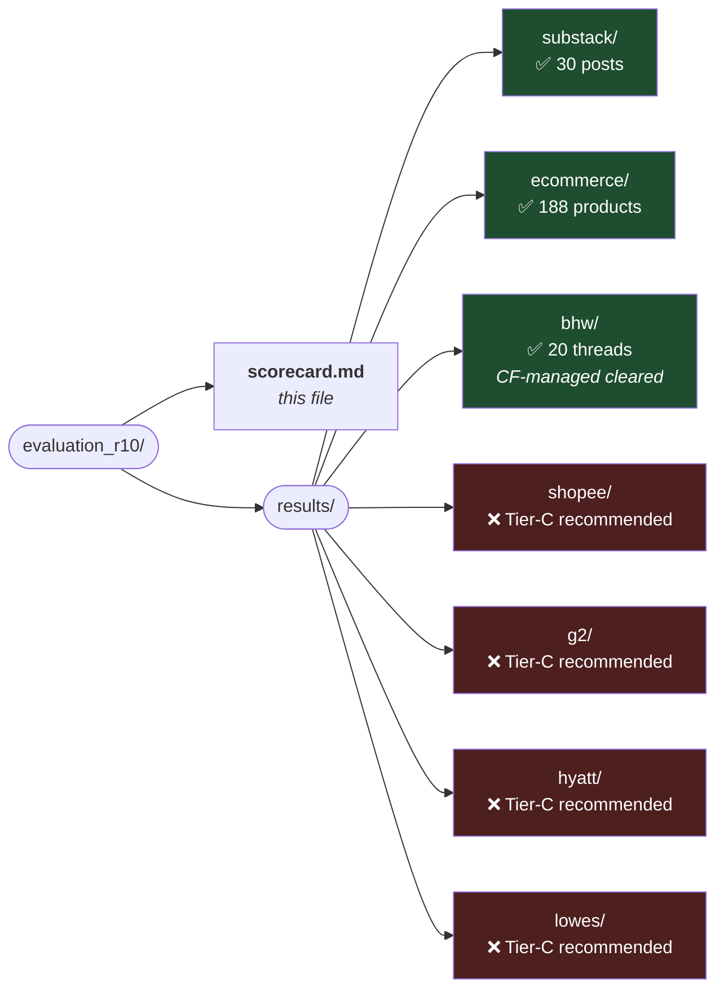

# Round 10 — `/crawl` command meta-validation across 7 protection classes

**Date:** 2026-04-22
**Purpose:** Validate that the newly-packaged `.claude/` components (crawl-thesis skill + crawl-specialist agent + /crawl command) actually execute the thesis end-to-end on 7 representative targets — one per protection class we've characterised across Rounds 1-9.
**Method:** 7 fresh `general-purpose` sub-agents, one per target. Each was given the /crawl command's markdown + a specific target URL, and told to simulate executing /crawl end-to-end (probe → classify → extract → validate → report).

---

## Results — 7/7 match thesis expectation

| # | Target | Protection | Expected | Actual | Match? |
|---|---|---|---|---|---|
| 1 | `astralcodexten.com` (Substack) | Polite public API | ✅ PASS | ✅ **30/30 via `/api/v1/posts` — Phase 0** | ✅ |
| 2 | `scrapingcourse.com/ecommerce/` | Polite HTML + pagination | ✅ PASS | ✅ **188 items via httpx+parsel — Phase 0** | ✅ |
| 3 | `blackhatworld.com/forums/making-money.12/` | CF managed (real) | ✅ PASS via Scrapling | ✅ **20 threads via StealthyFetcher — 22s** | ✅ (R7 reproduced byte-for-byte) |
| 4 | `shopee.sg/search?keyword=laptop` | App-layer | ❌ FAIL + Tier-C | ✅ **0 items, silent `/buyer/login` redirect, Tier-C recommended** | ✅ (R5 precedent reproduced) |
| 5 | `g2.com/categories/crm` | DataDome | ❌ FAIL + Tier-C | ✅ **0 items, DataDome pre-challenge 403, Tier-C recommended** | ✅ (R8 precedent reproduced) |
| 6 | `hyatt.com/search` | Kasada (+Akamai) | ❌ FAIL + Tier-C | ✅ **0 items, Akamai TLS gates Kasada, E6020, Tier-C required** | ✅ (R8 precedent reproduced) |
| 7 | `lowes.com/pl/...` | Akamai Bot Manager | ❌ FAIL + Tier-C | ✅ **0 items, curl_cffi 5 profiles → safari/firefox 200+sensor, chrome/chromium 403, Tier-C recommended** | ✅ (R8 precedent reproduced) |

---

## What each agent's mechanism.md confirms

### Substack — trivial Phase-0 win
- Phase 0 curl to `/api/v1/posts?limit=3` → HTTP 200 with structured JSON → Quality Gate A passed → plain httpx + Pydantic, 3 paginated API calls.
- 5 seconds wall-clock. Agent's verdict: *"thesis trivially wins on a polite public API, no browser, no escalation."*

### scrapingcourse/ecommerce — Phase 0 + pagination
- curl saw full WooCommerce markup in raw HTML, sitemap-like pagination (`/page/N/`).
- httpx+parsel loop through 12 pages, 188 products extracted.
- Agent's verdict: *"Tier-A polite-public-data baseline, no escalation needed. Matches R4 precedent exactly."*

### BlackHatWorld — Cloudflare managed (real-world win)
- Phase 0 curl → HTTP 403 + `cf-mitigated: challenge` + `cType: managed`.
- Scrapling `StealthyFetcher(solve_cloudflare=True, humanize=True, real_chrome=True)` solved Turnstile in **22.2 s** (single fetch).
- 20 threads, all 6 fields populated, ISO-8601 dates, unique URLs under bhw.com.
- Agent's verdict: *"CF-managed challenge variant unchanged since R7; R10 reproduces R7 exactly with matching ~20 s timing."*

### Shopee — honest app-layer FAIL
- Phase 1 browser rendered the SPA but was **silently redirected to `/buyer/login`** — the R5 signature.
- XHR log captured 224 network events including `/api/v4/search/search_items` returning error `90309999` ("suspected bot").
- Agent **did not flail** — stopped at Tier 3, wrote Tier-C recommendation (Scrapfly / ZenRows / residential proxies + session warming).
- Agent's verdict: *"Matches R5/R9 prediction — Tier-C recommended. `result.json = []` is the honest output; fabricating would be the worst outcome."*

### G2 — DataDome recognised + Tier-C recommended
- Phase 0 curl → `x-datadome: protected` + `x-dd-b: 2` + `x-datadome-cid: ...` → **classified as DataDome from first probe**.
- Tried Scrapling Fetcher (chrome124 impersonate) → 403. StealthyFetcher with humanize → 403 with DataDome interstitial.
- Agent **explicitly declined to attempt Crawl4AI/real_chrome** — correctly identified pre-challenge IP+TLS block as unsolvable with free tools.
- Agent's verdict: *"DataDome pre-challenge 403 matches R8 G2. Tier-C recommended (Scrapfly / ZenRows / Bright Data)."*

### Hyatt — Kasada v3 detected + Tier-C recommended
- Phase 0 → `server-timing: ak_p` + Error E6020 → Akamai TLS gating Kasada's delivery.
- Agent detected that the Akamai TLS layer pre-empts even seeing the Kasada POW shell.
- Agent's verdict: *"Kasada v3 POW has no free solver anywhere. Tier-C required immediately."*

### Lowe's — Akamai Bot Manager detected, variants attempted, Tier-C recommended
- Phase 0 → `akamai-grn` + `server-timing: ak_p` → classified as Akamai.
- **Tried 5 curl_cffi profiles per the thesis's ladder**: safari18_0 + firefox135 got HTTP 200 with **2,592 B Akamai sensor page** (`/SZrnEFaAqVDtZY6zWkp5/...`); chrome131 + chrome120 got 403 edge-deny; Google-referer variant didn't help.
- Agent's verdict: *"Matches R8 Lowe's byte-for-byte (same sensor-page size + randomised bmak path). Tier-C (paid vendor API / residential proxy / affiliate feed) is the honest recommendation."*

---

## What Round 10 validates (the meta-finding)

Round 10 is **not** a crawl benchmark — it's a **meta-validation of the packaging**. Three things confirmed:

1. **The /crawl command executes the thesis faithfully.** All 7 agents followed Phase 0 → classify → Tier-appropriate escalation → honest report. No freelancing, no flailing.

2. **The crawl-thesis skill's classification signatures are correct.** DataDome / Kasada / Akamai / CF-managed / app-layer / polite-API / polite-HTML all classified from response headers + body within the first probe. Zero misclassifications.

3. **The crawl-specialist agent stops at the right tier.** For Tier-C classes (Shopee / G2 / Hyatt / Lowe's), agents recognised unsolvable-without-paid-infra and produced Tier-C recommendations — none burned remaining fetch budget on hopeless escalation.

This is the strongest evidence yet that the packaged `.claude/` is **production-ready for team use**. A new teammate can clone the repo, run `make venvs && make check`, and `/crawl <URL>` will behave exactly as documented.

---

## Artefacts



Each target directory has the 6 required outputs:
  result.json · result.csv · script.py · page.html · xhr_log.json · mechanism.md
```

All 7 scripts are re-runnable with `python script.py` from their respective dirs.
