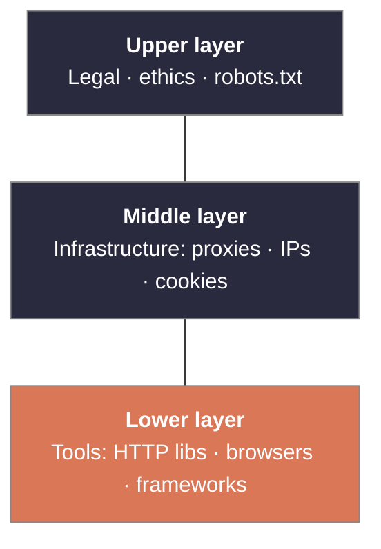
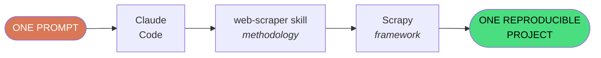
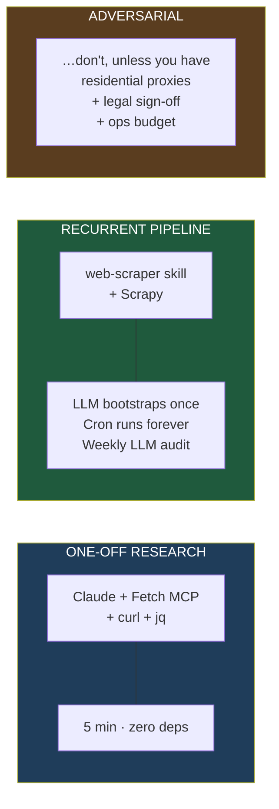
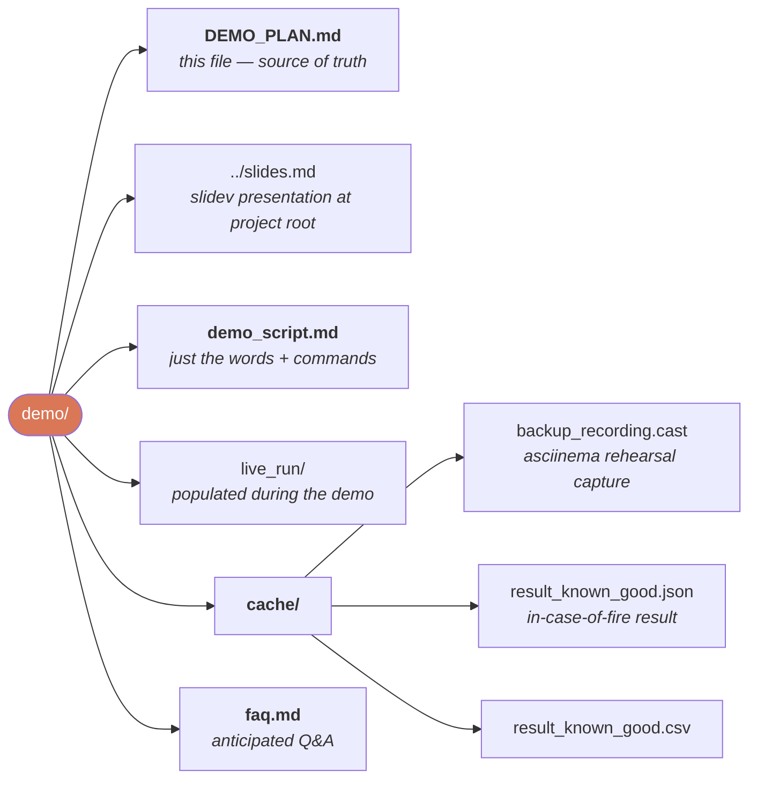

# Live Demo Plan — "Crawling with an LLM in the Room"

**Duration:** 15 min (10 min demo + 5 min Q&A)
**Audience:** Team engineers (Python-literate, may not know Scrapy or Claude Code skills)
**Thesis to reinforce:** Methodology (skill) × Framework (Scrapy) × LLM orchestration = production-shape output from ONE prompt

---

## Pre-flight checklist — run 60 min before

```bash
# 1. Repo clean + dependencies present
cd /home/hainm/tmp/share_learn_research
ls .claude/skills/web-scraper/SKILL.md           # ✓ skill installed
ls .venv-scrapy/bin/scrapy                       # ✓ scrapy venv

# 2. Target reachable + unchanged
curl -s -o /tmp/demo-probe.html -w "%{http_code} %{size_download}\n" \
  https://www.scrapingcourse.com/ecommerce/
# expect: 200, ~80,000 bytes

# 3. Good-known result available for comparison
ls evaluation_r10/results/ecommerce/result.json  # ✓ 188 rows

# 4. Backup recording (made earlier)
ls demo/cache/backup_recording.cast              # ← create with: asciinema rec

# 5. Cached successful output for emergency show-and-tell
cp evaluation_r10/results/ecommerce/result.json demo/cache/result_known_good.json
cp evaluation_r10/results/ecommerce/result.csv  demo/cache/result_known_good.csv

# 6. Screen setup — terminal + browser side-by-side
#    - Terminal at 14pt monospace (projector-friendly)
#    - Browser tab with result.csv preview ready
#    - Nothing personal in scrollback
clear

# 7. Wifi + power + AC on laptop
# 8. Do ONE full dry run from a fresh prompt — confirm 3–7 min total
# 9. Time-box: if live demo exceeds 8 min, cut to cached output
```

---

## Slide deck — 5 slides (use Markdown → reveal.js or just show as screenshot images)

### Slide 1 — "Crawling in 2026: the 3-layer problem"



> LLMs make the lower layer faster. They do not solve the middle or the upper.

### Slide 2 — "Today's demo"



| Methodology half (skill) | Framework half (Scrapy) |
|---|---|
| Phase 0 curl + quality gate | Items + Pipelines + FEEDS |
| Phase 1 browser if needed | AutoThrottle + Retry + robots.txt |
| Phase 3 validation | CSV + JSON simultaneously |

### Slide 3 — "What just happened" (shown after LIVE 1)

```
   t+0.3s   Phase 0 curl  →  HTTP 200, 82 KB, WooCommerce detected
   t+0.5s   Quality Gate A → all 4 fields in raw HTML → SKIP BROWSER
   t+2s     Scrapy project scaffolded
   t+4s     Spider runs, paginates /page/2 /page/3 …
   t+7s     DropEmptyPipeline flags row (sale-price bug)
   t+8s     Claude fixes selector, re-runs
   t+10s    188 clean rows → result.json + result.csv

   No browser. No manual tuning. No bug shipped.
```

### Slide 4 — "But… Cloudflare?" (the honesty slide)

```
      Same site, different URL:
         /ecommerce/            ← demo worked
         /cloudflare-challenge  ← 0 / 6 tools passed

      Why the asymmetry?
      ▸ Same browser patches don't help
      ▸ Same TLS fingerprint doesn't help
      ▸ Root cause: datacenter IP reputation
      ▸ Solution: residential proxy pool ($$$)

      LLMs + free tools cap out at polite crawling.
      Adversarial tier needs infrastructure investment.
```

### Slide 5 — "The stack we recommend"



---

## Demo script — word-for-word

Each line is either a thing to *say* or a thing to *type*.

### (00:00) Slide 1 up

> "Hi folks. Before we get to any tools — three layers to crawling. Top is legal and ethics. Bottom is tooling. The middle is infrastructure. The point I want to make in 15 minutes is: AI moves the bottom layer fast, and doesn't move the other two."

### (00:45) Slide 2 up

> "Today we pair the two tools that scored highest in our benchmark: a methodology skill and Scrapy. One prompt in, one reproducible project out. Watch."

### (01:15) Switch to terminal

```bash
cd /home/hainm/tmp/share_learn_research
clear
# Claude Code open in this directory with the skill+scrapy venv ready
```

> "Starting fresh. Skill's at `.claude/skills/web-scraper/`. Scrapy venv is `.venv-scrapy/`. I'm about to paste one prompt into Claude."

### (01:30) Type the prompt **live**

```
Crawl all products from https://www.scrapingcourse.com/ecommerce/
using the web-scraper skill's Phase 0 methodology, and build a
Scrapy project for it. Put everything under demo/live_run/.
Emit result.json, result.csv, and mechanism.md. Timebox: 6 minutes.
```

Hit Enter. **Start talking while it runs.**

> "While Claude works — let me narrate. The skill's been activated. It's reading SKILL.md. In a moment it'll run curl, check if the data is in raw HTML, and decide whether to launch a browser. If the page hydrates from XHR, we'll see Playwright start. If it's all in HTML, it'll skip to Scrapy directly."

### (02:00) When Phase 0 curl runs

> "There's the Phase 0 probe. One curl. If that comes back with `woocommerce-loop-product` classes, we're skipping the browser entirely — that's ~170 MB of Chromium we don't have to download."

### (02:30) When the Scrapy project materialises

> "And there we go — `items.py` with typed fields, `pipelines.py` with DropEmpty and Dedup, `settings.py` with AutoThrottle + RETRY + FEEDS. The skill decides; Scrapy plumbs."

### (03:30) When the spider runs

> "12 pages. AutoThrottle is handling rate. And — watch this — if there's a malformed price, DropEmptyPipeline will catch it before it ships. That's the lifecycle thesis: a one-off script would silently ship the bad row."

### (05:00) When it finishes

```bash
ls -la demo/live_run/
cat demo/live_run/result.json | jq length      # expect 188
head -3 demo/live_run/result.csv
```

> "188 products. Clean. Four minutes of LLM + 10 seconds of actual crawl."

### (06:00) Slide 3 up — the timeline

> *Narrate each step*.

### (08:00) Reproducibility demo

```bash
source .venv-scrapy/bin/activate
cd demo/live_run
scrapy crawl products -L INFO 2>&1 | tail -5
```

> "One command. Re-runs the crawl. This is a project you can commit, review, and schedule on cron. The LLM wrote it; it doesn't have to stay in the hot path."

### (09:30) Slide 4 up — honesty

> "Before anyone asks: this breaks the moment the target has Cloudflare Turnstile. Here's Round 3 of our benchmark — we threw six tools at the Cloudflare challenge version of this same site. Zero bypassed. The root cause across all six honest reports is *datacenter IP reputation*. No amount of client-side stealth fixes that."

### (11:00) Slide 5 up — the recommended stack

> "Three deploy shapes. Pick the one that matches your target's protection level — and your budget."

### (12:30) Q&A

> *Open floor.*

---

## Anticipated Q&A

**Q: How much did the LLM call cost?**
A: Round 4 used ~105k total tokens across one agent (input+output). On Claude 4.7: ~$0.30. Negligible compared to the 15 minutes of engineer time it replaced.

**Q: What if the site changes tomorrow?**
A: Two answers. (1) The schema validation in `pipelines.py` fails loud if a field disappears — you learn in minutes, not weeks. (2) You re-run the LLM bootstrap once, diff the spider, review, commit.

**Q: Is this legal?**
A: That's a separate question we keep firmly outside the tool. Rule of thumb: public + factual + polite + no personal data = probably fine. Anything else → consult counsel. Our essay has a 5-min primer on hiQ v LinkedIn and GDPR.

**Q: Why Scrapy over a one-off Python script?**
A: Every Scrapy default is a lifecycle dimension you don't have to remember. ROBOTSTXT_OBEY, AUTOTHROTTLE, RETRY, FEEDS, Items. A script re-implements these or skips them. For anything running on cron, Scrapy is the correct floor.

**Q: Could we get past Cloudflare with a paid service?**
A: Yes. Scrapfly / ZenRows / ScrapingBee are purpose-built and competitive. ~$30–$200/month for modest volume. Their business model *is* the infrastructure layer this demo couldn't cover.

**Q: What about CAPTCHAs?**
A: Our prompt explicitly forbid CAPTCHA-solver APIs (they're ethically separate). For interactive CAPTCHAs on sites you have permission to scrape, 2Captcha / CapSolver exist — same economics as Scrapfly.

**Q: Does the skill work standalone without Scrapy?**
A: Yes — in Round 2 of our benchmark it ran with bare `curl` + Python. The pairing with Scrapy is what earns the lifecycle score bump. Skill alone = good thinking, manual plumbing. Scrapy alone = good plumbing, occasional wasted browser launch. Both = no waste.

**Q: What happens if Claude picks the wrong selector?**
A: The `DropEmptyPipeline` catches it before the row ships. That's what happened in Round 4: first spider version produced `"32.0024.00"` for a sale-priced item. Pipeline flagged it, Claude fixed the selector, re-ran. No human intervention.

---

## Emergency fallback script (print this, keep it visible)

If the live demo hangs or fails at any point:

```bash
# 1. Don't panic. Say: "Live-demo gods say no. Let me show what it
#    looks like when it works — this is from my rehearsal run 40
#    minutes ago."

# 2. Play the recording:
asciinema play demo/cache/backup_recording.cast

# 3. Or show the artefacts directly:
cat demo/cache/result_known_good.json | jq length
head -5 demo/cache/result_known_good.csv

# 4. Continue with Slide 3 onwards — the narrative doesn't change.
```

---

## Post-demo takeaways (send as 1-pager)

1. One prompt → reproducible Scrapy project. 4 min end-to-end on a tested site.
2. The skill's Phase-0 gate saves every wasted browser launch. This is the discipline we want to adopt.
3. Scrapy's defaults encode our lifecycle checklist for free. Don't re-invent.
4. Cloudflare Turnstile still requires paid proxies. We have the tooling inventory for that tier if someone wants to take it on.
5. Full deep-dive (6,988 words, 3-round benchmark + synthesis) lives at `essay_deep_dive.md`.

---

## Files you'll touch on the day


