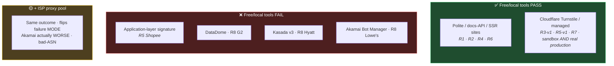
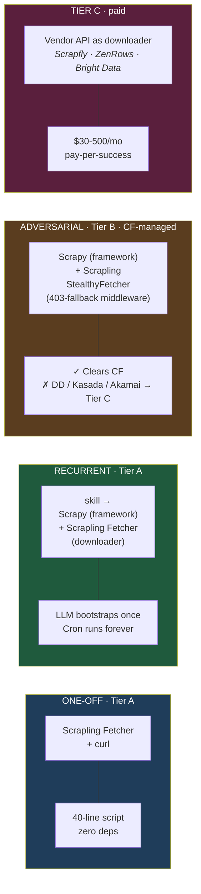

# Crawling the Web with an LLM in the Room

## Share & Learn

<div class="pt-12">
  <div class="text-xl opacity-80">Nine benchmark rounds · one calibrated thesis · what free tools actually do in 2026</div>
</div>

<div class="abs-bl mx-14 my-12 text-sm opacity-70">
  <div><strong>hainm</strong></div>
  <div>22/04/2026</div>
</div>

<!--
Welcome. 25-minute talk + 5 min Q&A. Don't rush the opening — the thesis is counter-intuitive and I need the audience to stay curious.
-->

---
layout: center
class: text-center
---

# "LLMs can scrape anything now."

<div v-click class="mt-8 text-xl opacity-80">
That's wrong by omission.
</div>

<div v-click class="mt-12 max-w-2xl mx-auto text-left text-base opacity-90">

Crawling the web has been a discipline for thirty years. Most hard parts — politeness, legal exposure, schema drift, anti-bot cat-and-mouse — aren't the parts an LLM solves.

The parts LLMs **do** help with — deciding *where* data lives, writing glue, escalating when the first attempt fails — are subtler than the marketing admits.

**I ran 9 benchmark rounds across 6 targets to calibrate exactly where the line sits.**

</div>

<!--
Pause after line 1. Let it land. The audience came expecting magic. Tell them: no magic, but there IS leverage. I'll show them where.
-->

---
layout: center
class: text-center
---

# Four things this talk will do

<div class="mt-8 grid grid-cols-1 gap-5 max-w-3xl mx-auto text-left">

<div v-click class="flex items-start gap-6">
  <div class="text-3xl font-bold opacity-30 leading-none w-10 text-right pt-1">1</div>
  <div class="text-xl">Teach the discipline — <span class="opacity-70">what we'd learn with or without an LLM</span></div>
</div>

<div v-click class="flex items-start gap-6">
  <div class="text-3xl font-bold opacity-30 leading-none w-10 text-right pt-1">2</div>
  <div class="text-xl">Survey the tool ecosystem — <span class="opacity-70">what's out there, why it keeps moving</span></div>
</div>

<div v-click class="flex items-start gap-6">
  <div class="text-3xl font-bold opacity-30 leading-none w-10 text-right pt-1">3</div>
  <div class="text-xl">Show what LLMs <em>actually</em> change</div>
</div>

<div v-click class="flex items-start gap-6">
  <div class="text-3xl font-bold opacity-30 leading-none w-10 text-right pt-1">4</div>
  <div class="text-xl">Give the calibrated ceiling — <span class="opacity-70">9 rounds on 6 targets</span></div>
</div>

</div>

<!--
Table of contents. Each click = one of the four parts. Hold for eye contact after each.
-->

---
layout: section
---

# Part 1 · Crawling as a discipline

<div class="opacity-60 text-lg mt-4">The things we'd have to learn whether an LLM existed or not</div>

---

# A tiny bit of history

<div class="mt-6 text-lg opacity-90 leading-relaxed">

Three decades compressed: <br>
**1994** — WebCrawler + `robots.txt` (the social contract, now [RFC 9309](https://www.rfc-editor.org/rfc/rfc9309.html))<br>
**2000s** — Google-scale infrastructure makes crawling a commodity<br>
**today** — the <strong class="text-amber-400">adversarial era</strong> — Cloudflare · Akamai · DataDome · JA3/JA4

</div>

<div v-click class="mt-10 text-center text-xl">

Every capability begets a counter-measure.

**Don't assume today's best trick survives six months.**

</div>

<!--
One slide. Don't dwell on dates. The point is this is a *living* adversarial discipline — LLMs don't change that arc.
-->

---

# The 6-phase lifecycle

| # | Phase | The question |
|---:|---|---|
| 1 | **Scope** | What field? What freshness? What cost ceiling? |
| 2 | **Research** | Public API? ToS? robots.txt? Legal line? |
| 3 | **Discovery** | *Where does the data physically live?* SSR, XHR, GraphQL, SSR blob? |
| 4 | **Extract** | The actual HTTP + parse → structured rows |
| 5 | **Validate** | Schema? Types? Freshness? Cross-source sanity? |
| 6 | **Scale & Persist** | Pagination, concurrency, retries, dedup, persistence |

<div v-click class="mt-6 text-center text-base opacity-80">

Skipping Research · conflating Discovery with Extract · treating Scale as an afterthought — <strong>these are the three traps that cost the industry thousands of hours</strong>.

</div>

---

# What sites fight back with — 5 layers

<div class="text-xs opacity-70 mb-2">A properly tuned bot manager combines <em>every</em> layer. Our counter is one tool per layer.</div>

<div class="text-sm leading-relaxed space-y-2 mt-4">

<div><strong>a) robots.txt + ToS</strong> — voluntary · good-faith evidence → <code>ROBOTSTXT_OBEY=True</code></div>

<div><strong>b) IP reputation</strong> — ASN · subnet age · behaviour across <em>all</em> CF customers → residential proxy pool (Tier C)</div>

<div><strong>c) TLS / HTTP-2 fingerprint</strong> — JA3 / JA4, <code>requests</code> is instantly recognisable → <code>curl_cffi</code> · Scrapling <code>Fetcher</code></div>

<div><strong>d) Browser fingerprint</strong> — <code>navigator.webdriver</code> · Canvas · WebGL · input timing → <code>camoufox</code> · Scrapling <code>StealthyFetcher</code> · <code>nodriver</code></div>

<div><strong>e) JS challenge / CAPTCHA</strong> — <code>cf_clearance</code> cookie after probe passes → <code>solve_cloudflare=True</code> (CF) · paid solver (DataDome)</div>

</div>

<div v-click class="mt-6 text-center text-sm opacity-80">

<strong>Safe defaults:</strong> robots.txt · UA with contact · ≤1 req/s · prefer official API · no personal data.

</div>

---

# What a crawl engineer actually worries about

<div class="opacity-70 text-sm">Almost never the adversary. Almost always the <em>quiet</em> failure.</div>

<div class="mt-4 grid grid-cols-2 gap-4 text-sm">

<div>

<v-clicks>

- **Politeness drift** — a junior adds `concurrency=100` "for tonight"
- **Schema drift** — new column ships, scraper silently writes `null` for 3 months
- **Freshness SLA violations** — target deploys at 3am, data arrives stale
- **Dedup key collisions** — target reuses an ID

</v-clicks>

</div>

<div>

<v-clicks>

- **Poisoned pagination** — "next page" returns the same page
- **Silent 200s** — maintenance HTML returns HTTP 200 with zero rows
- **Partial bans** — single UA throttled to 1 req/s silently, data stale for hours
- **Legal exit** — how do we stop + delete if asked?

</v-clicks>

</div>

</div>

<div v-click class="mt-8 text-center text-xl">

**Every field needs a validator. Every response needs a plausibility check. Every crawl emits a freshness signal.**

</div>

---
layout: section
---

# Part 2 · The tool ecosystem

<div class="opacity-60 text-lg mt-4">What's out there in 2026 — and why the list keeps moving</div>

---

# Tools evolve. Anti-bot evolves faster. <br><span class="opacity-70">No tool is absolute.</span>

<div class="mt-6 grid grid-cols-2 gap-6 max-w-5xl mx-auto">

<div v-click class="bg-white/5 p-5 rounded">

### 🛠️ Tools move monthly

Scrapling clears Cloudflare-managed in early 2026. By 2027? Maybe something else.

Everything in this Part is a **dated snapshot**, not a manifesto.

→ *Inputs to our benchmark — not substitutes for one.*

</div>

<div v-click class="bg-white/5 p-5 rounded">

### 🛡️ Anti-bot moves weekly

Cloudflare · DataDome · Akamai · Kasada ship detection changes constantly.

Every technique here has a **half-life**.

→ *The question is never "which tool always wins?" but "which tool matches this target, today?"*

</div>

</div>

<div v-click class="mt-8 text-center text-lg opacity-90">

Part 2 covers <strong>what we can reach for</strong> · Part 3 adds the LLM on top.

</div>

---

# Spotlight · Scrapling

<div class="text-lg opacity-80 mb-4">The single most powerful <strong>free / local</strong> anti-bot tool we benchmarked.<br>Install one thing — make it this one (and re-benchmark next quarter).</div>

<div class="grid grid-cols-3 gap-4 mt-4 text-sm">

<div v-click class="bg-white/5 p-4 rounded">

### 🏃 `Fetcher`

TLS-impersonating HTTP client (curl_cffi under the hood)

JA3/JA4 fingerprint spoof + HTTP/2 built-in

*Drop-in for plain HTTP when we need to look like a real browser*

</div>

<div v-click class="bg-white/5 p-4 rounded">

### 🎭 `DynamicFetcher`

Full Playwright · Chromium or Chrome · proxy + cookie support

*For JS-rendered pages with no anti-bot*

</div>

<div v-click class="bg-amber-900/40 p-4 rounded border-2 border-amber-500/50">

### ⭐ `StealthyFetcher`

Camoufox + humanise + **`solve_cloudflare=True`**

**Clears Cloudflare managed / Turnstile in ~20 s.**

R5-v1 sandbox ✓ · R7 real (BHW) ✓

</div>

</div>

<div v-click class="mt-6 text-center text-base opacity-90">

Also: adaptive selectors (auto-relocate on site changes) · built-in MCP server · session primitives · async streaming · BSD-3.

</div>

---

# The infrastructure layer · proxies

<div class="text-lg opacity-80 mb-4">Software tools are half the stack. <strong>Proxies + anti-detect browsers</strong> are the other half.</div>

| Tier | What it is | Trust | ~Price/GB | Use when |
|---|---|---|---|---|
| **Datacenter** | AWS/GCP-style IPs | Lowest | $1 | Polite targets · high throughput |
| **ISP / static residential** | ISP-assigned · DC-hosted | Mid-high | $3-5 | Logged-in sessions · long-lived jobs |
| **Residential** | Real end-user home IPs | High | $3-8 | CF · DataDome · Akamai-heavy |
| **Mobile (4G/5G)** | Cellular carrier NAT | Highest | $7-15 | Most-protected targets |

<div v-click class="mt-6 text-center text-base opacity-90">

Providers: [Bright Data](https://brightdata.com/) · [Smartproxy](https://smartproxy.com/) · [Oxylabs](https://oxylabs.io/) · [NetNut](https://netnut.io/) · [IPRoyal](https://iproyal.com/) · [Soax](https://soax.com/).
<span class="opacity-70">**R9 evidence:** price band ≠ trust. The "ISP-class" pool we tested was still on Akamai's bad-ASN list.</span>

</div>

---

# The infrastructure layer · anti-detect browsers

<div class="text-sm opacity-80 mb-3">Chromium forks with manufactured per-profile fingerprints. GUI version of what Scrapling does programmatically.</div>

| Tool | Pitch |
|---|---|
| **[Multilogin](https://multilogin.com/)** | Gold standard · scale · team collab · ~$99+/mo |
| **[GoLogin](https://gologin.com/)** | Budget-friendly · free tier |
| **[Kameleo](https://kameleo.io/)** | Mobile fingerprint specialist |
| **[AdsPower](https://www.adspower.com/)** | 🇨🇳 e-commerce + ads · automation API |
| **[Dolphin Anty](https://dolphin-anty.com/)** | Affiliate marketing · 100s of accounts |
| **[GPM Login](https://gpmlogin.com/)** | 🇻🇳 one-time lifetime license · VN MMO community |

<div v-click class="mt-4 text-center text-sm opacity-90">

<strong>Buy</strong> when the team already runs many profiles by hand · <strong>skip</strong> for programmatic stealth (Scrapling, nodriver) or a vendor API.

</div>

---
layout: section
---

# Part 3 · Enter the LLM

<div class="opacity-60 text-lg mt-4">What LLMs <em>actually</em> change — and what they don't</div>

---

# What LLMs actually add

<div class="mt-6 grid grid-cols-1 gap-4 max-w-3xl mx-auto">

<div v-click class="flex items-start gap-5 bg-emerald-900/20 p-4 rounded">
  <div class="text-3xl font-bold opacity-40 leading-none w-10 text-right">1</div>
  <div>
    <div class="text-lg font-semibold">Reasoning about where data lives</div>
    <div class="text-sm opacity-80 mt-1">Spot the <code>__NEXT_DATA__</code> blob, generate the <code>json.loads(...)[...]</code> path in one round-trip. 10-20 min of DevTools clicking → 30 seconds.</div>
  </div>
</div>

<div v-click class="flex items-start gap-5 bg-emerald-900/20 p-4 rounded">
  <div class="text-3xl font-bold opacity-40 leading-none w-10 text-right">2</div>
  <div>
    <div class="text-lg font-semibold">Gluing the boring parts</div>
    <div class="text-sm opacity-80 mt-1">Config · CSV exporters · Pydantic models · small CLIs. The 80% of scraping code that isn't algorithmically interesting.</div>
  </div>
</div>

<div v-click class="flex items-start gap-5 bg-emerald-900/20 p-4 rounded">
  <div class="text-3xl font-bold opacity-40 leading-none w-10 text-right">3</div>
  <div>
    <div class="text-lg font-semibold">Escalating when the first attempt fails</div>
    <div class="text-sm opacity-80 mt-1">Sees the Cloudflare interstitial → reads headers → proposes Scrapling. <em>Doesn't magically succeed</em> but cuts debug time.</div>
  </div>
</div>

<div v-click class="flex items-start gap-5 bg-emerald-900/20 p-4 rounded">
  <div class="text-3xl font-bold opacity-40 leading-none w-10 text-right">4</div>
  <div>
    <div class="text-lg font-semibold">Writing the post-mortem</div>
    <div class="text-sm opacity-80 mt-1">"What I did · what worked · what I'd try next" — immediately useful for the next engineer.</div>
  </div>
</div>

</div>

---

# What LLMs DON'T add

<div class="mt-6 grid grid-cols-1 gap-3 max-w-3xl mx-auto">

<div v-click class="flex items-start gap-5 bg-red-900/20 p-4 rounded">
  <div class="text-2xl opacity-60 w-10 text-center">✗</div>
  <div>
    <div class="text-lg font-semibold">Cloudflare bypass magic</div>
    <div class="text-sm opacity-80">No orchestration changes the IP-reputation reality underneath. (R3 evidence: 0/6.)</div>
  </div>
</div>

<div v-click class="flex items-start gap-5 bg-red-900/20 p-4 rounded">
  <div class="text-2xl opacity-60 w-10 text-center">✗</div>
  <div>
    <div class="text-lg font-semibold">Ethics judgement</div>
    <div class="text-sm opacity-80">The LLM will happily scrape a site whose ToS forbids it. The legal/ethics call stays with us.</div>
  </div>
</div>

<div v-click class="flex items-start gap-5 bg-red-900/20 p-4 rounded">
  <div class="text-2xl opacity-60 w-10 text-center">✗</div>
  <div>
    <div class="text-lg font-semibold">Schema-drift detection across weeks</div>
    <div class="text-sm opacity-80">LLMs don't remember between runs. They propose validators; they don't notice six fields became seven.</div>
  </div>
</div>

<div v-click class="flex items-start gap-5 bg-red-900/20 p-4 rounded">
  <div class="text-2xl opacity-60 w-10 text-center">✗</div>
  <div>
    <div class="text-lg font-semibold">Proxy procurement + rotation + payment</div>
    <div class="text-sm opacity-80">They configure; humans procure and pay.</div>
  </div>
</div>

</div>

<div v-click class="mt-6 text-center text-lg opacity-90">

LLMs accelerate <strong>discovery + glue + debug</strong> by 3-10× · leave <strong>policy + proxy + observability</strong> unchanged · don't help on the hardest adversarial targets.

</div>

---
layout: section
---

# Part 4 · The benchmarks

<div class="opacity-60 text-lg mt-4">6 rounds · each run twice (tool-diversity + Scrapling-only) · evidence over marketing</div>

---

# The 6 rounds at a glance

| # | Target | Protection | Outcome |
|---:|---|---|---|
| 1 | CoinMarketCap | SSR blob | ✅ 100/100 · Fetch MCP wins · Scrapling 0.60 s |
| 2 | Binance top-100 USDT | SPA + 3 data paths | ✅ 6/6 tools · Scrapling 0.79 s on REST mirror |
| **3** | scrapingcourse (CF sandbox) | Cloudflare managed | ❌ 0/6 generalists · ✅ **Scrapling clears in ~20 s** |
| 4 | scrapingcourse ecomm | None | ✅ skill × Scrapy 188/188 · caught a real bug mid-run |
| **5** | **Shopee** · real retail | App-layer | ❌ silent `/login` · ISP proxy doesn't help |
| **6** | G2 / Hyatt / Lowe's | DataDome · Kasada · Akamai | ❌ 0/3 — **Tier-C required** |

<div v-click class="mt-4 text-center text-sm opacity-80">

<strong>R3 bonus:</strong> Scrapling's CF solve <strong>transfers to real production</strong> — BlackHatWorld (real CF forum), ~17 s. Sandbox-to-production parity confirmed.

</div>

---
layout: two-cols
---

# Rounds 1–2 · the happy path

✅ **CMC top-100** — data already in SSR `__NEXT_DATA__`. Plain curl + JSON parse wins. Fetch MCP: 26/30 quality.

✅ **Binance** — three discovery paths (docs · XHR · SSR blob). **Scrapy ties Fetch MCP** because framework defaults earn lifecycle points for free.

<div class="mt-6 text-sm opacity-80">

**Lesson:** If target data is in raw HTML or a documented API, you don't need anything fancy. Phase 0 curl saves you 80% of the work.

</div>

::right::

# Round 3 · the wall · and how Scrapling moves it

❌ **6 generalist tools · 0/6 bypassed** — all hit HTTP 403 + `cf-mitigated: challenge`.

> *"Datacenter IP reputation — this is an infrastructure problem, not a tool problem."*

<div v-click class="mt-3 p-3 bg-emerald-900/30 rounded text-sm">

✅ **Then Scrapling.** `StealthyFetcher(solve_cloudflare=True)` clears the same challenge in **~20 s** on the same IP class. Sandbox-to-real-production confirmed via **BlackHatWorld** (real CF-managed forum, ~17 s solve).

</div>

<div v-click class="mt-3 text-xs opacity-80">

Caveat — a cleared CF response is necessary but not sufficient. A cleared BHW response later hit an **origin login wall** (XenForo `data-template="login"`). **CF-cleared ≠ data-extracted.**

</div>

---

# Round 4 · the synthesis

<div class="text-lg opacity-80 mb-4">Pair the thesis winner (skill's methodology) with the ops winner (Scrapy's framework)</div>

<div class="grid grid-cols-2 gap-8 mt-4">

<div>

### The run

- Target: scrapingcourse ecomm · 188 products · 12 paginated pages
- Tool: `web-scraper` skill → Phase 0 curl → **Quality Gate A** passed (data in HTML)
- Scrapy wired up with `Items` · `Pipelines` · `FEEDS` · `AutoThrottle`
- **10.2 s wall-clock**

</div>

<div>

### The killer result

During the crawl, `DropEmptyPipeline` flagged a row: `"32.0024.00"` (sale-price concatenation bug).

**Claude fixed the selector, re-ran, shipped clean 188 rows.**

**Zero human intervention.**

A hand-rolled script would have silently shipped the bad row.

</div>

</div>

<div v-click class="mt-8 text-center text-xl opacity-90">

**29 / 30 lifecycle score** — the highest of any run across the whole benchmark set.

</div>

---

# Round 5 · Shopee · the reality check

<div class="text-lg opacity-80 mb-4">A <strong>real</strong> commercial retail site. Application-layer protection.</div>

<div class="grid grid-cols-2 gap-8 mt-4 text-sm">

<div>

### Two attempts

**Attempt 1** — thin Scrapling tiers → silent `/buyer/login` redirect. FAIL.

**Attempt 2** — thesis-faithful. Homepage-first warming, 14 cookies collected, 62 XHRs captured, API endpoint directly observed.

Direct replay with warm cookies + CSRF + full `Sec-Fetch-*` headers → **HTTP 403 + error `90309999`**.

</div>

<div>

### What the honest failure taught us

- Block lives at **IP rep + device telemetry + behavioural**, not cookies or TLS.
- Even a perfect thesis-run can't crack it.
- Evidence + mechanism.md is more useful than a fake screenshot.
- Discovered Shopee's fingerprint-telemetry endpoint: `df.infra.shopee.sg/v2/shpsec/web/report`

</div>

</div>

<div v-click class="mt-6 text-center text-lg opacity-90">

**Tier-C is the honest path** — paid vendor API or residential proxies + session management.
<span class="opacity-70">A follow-up run with an ISP-class proxy pool didn't flip the result — IP-rep is only one of four signals Shopee stacks.</span>

</div>

---

# Round 6 · the three walls

<div class="text-lg opacity-80 mb-4">Three real commercial sites · three different protection classes · full thesis applied in parallel</div>

| Target | Protection | How it blocked |
|---|---|---|
| **G2** CRM reviews | **DataDome** | `x-datadome: protected` edge block · pre-challenge IP block |
| **Hyatt** search | **Kasada v3** (on Akamai) | `window.KPSDK` · `ips.js` POW token-mint · **no free solver exists anywhere** |
| **Lowe's** category | **Akamai Bot Manager** | `akamai-grn` · `_abck` sensor · fingerprint detection upstream of the sensor |

<div v-click class="mt-4 text-center text-base opacity-90">

**0 / 3 extracted** — three distinct failure modes, each honestly documented.

Proxyway 2025: these three average **36–53 % success even on paid APIs** — a free-tier 0/3 is expected.

An ISP-class proxy pool made Akamai *worse* (`reason=bad-asn`). **Price band ≠ trust.**

</div>

---
layout: section
---

# The calibrated ceiling

<div class="opacity-60 text-lg mt-4">6 rounds · one binary boundary</div>

---

# Where the thesis actually works



---
layout: center
class: text-center
---

# The 2026 rule

<div v-click class="mt-8 text-3xl leading-snug max-w-4xl mx-auto">

Free tools clear everything up to and including <strong>Cloudflare-managed challenges.</strong><br>
<span class="opacity-70">Everything harder needs paid Tier-C infrastructure.</span>

</div>

<div v-click class="mt-12 text-lg opacity-60">

No exceptions found across 6 rounds (each run twice).

</div>

---

# The recommended stack

<div class="text-sm opacity-80 mb-2">Scrapy = <em>framework</em> (scheduling, AutoThrottle, Items, Pipelines, FEEDS). Scrapling = <em>fetcher library</em> (TLS impersonation, CF solver). They <strong>compose</strong> — plug Scrapling in as Scrapy's downloader.</div>



---

# Scale · the problem that only shows up at 100× URLs

<div class="text-sm opacity-80 mb-3">A scraper that works on 10 URLs and breaks at 10,000 is a <em>category</em> difference, not a bug.</div>

<div class="grid grid-cols-2 gap-4 text-xs">

<div v-click class="bg-white/5 p-3 rounded">

### 🗂️ Queue + frontier

Redis `scrapy-redis` / Postgres `SKIP LOCKED` · sticky-session routing · per-IP budget ~100 req then rotate

</div>

<div v-click class="bg-white/5 p-3 rounded">

### ⏱️ Politeness budgets

Per-domain leaky bucket (not per-worker AutoThrottle) · circuit breaker on CF-flood · adaptive throttle on challenge ratio

</div>

<div v-click class="bg-white/5 p-3 rounded">

### 💾 Storage at volume

Partitioned Parquet on S3 (`year=YYYY/month=MM/day=DD/*.parquet`) · schema hash per partition → drift alarm

</div>

<div v-click class="bg-white/5 p-3 rounded">

### 📊 Observability

`rows_extracted` · `p95_freshness` · `cf_challenge_ratio` · `schema_hash` alerts · `$/row` — page when sustained > 20 % or WoW drop > 30 %

</div>

</div>

<div v-click class="mt-4 text-center text-base opacity-90">

Scale isn't a tool choice — it's metric-backed decisions about <strong>when to stop</strong> (cost / freshness / pool depletion) and <strong>what to notice</strong> (ratio changes, drift, silent-200 spikes).

</div>

---
layout: section
---

# 5 takeaways

---

# 5 takeaways

<div class="mt-6 grid grid-cols-1 gap-4 max-w-3xl mx-auto">

<div v-click class="flex items-start gap-5 bg-white/5 p-4 rounded">
  <div class="text-3xl font-bold opacity-40 leading-none w-10 text-right">1</div>
  <div>
    <div class="text-lg font-semibold">"Find where the data lives" beats "find the backend API"</div>
    <div class="text-sm opacity-80">In R2 alone, data lived in 3 places: SSR blob · XHR · public API. No single tool found all three. Production pipelines are compositions.</div>
  </div>
</div>

<div v-click class="flex items-start gap-5 bg-white/5 p-4 rounded">
  <div class="text-3xl font-bold opacity-40 leading-none w-10 text-right">2</div>
  <div>
    <div class="text-lg font-semibold">Phase 0 curl decides 80% of the work</div>
    <div class="text-sm opacity-80">If raw HTML has what you need, don't launch a browser. Ever.</div>
  </div>
</div>

<div v-click class="flex items-start gap-5 bg-white/5 p-4 rounded">
  <div class="text-3xl font-bold opacity-40 leading-none w-10 text-right">3</div>
  <div>
    <div class="text-lg font-semibold">Framework defaults beat hand-rolled features</div>
    <div class="text-sm opacity-80">Scrapy's <code>AutoThrottle</code>, <code>Items</code>, <code>FEEDS</code>, <code>RobotsTxt</code> = lifecycle hygiene as config. R4's auto-bug-catch proves it.</div>
  </div>
</div>

<div v-click class="flex items-start gap-5 bg-white/5 p-4 rounded">
  <div class="text-3xl font-bold opacity-40 leading-none w-10 text-right">4</div>
  <div>
    <div class="text-lg font-semibold">Browsers for <em>discovery</em> · plain HTTP for <em>scaled fetching</em></div>
    <div class="text-sm opacity-80">Find in a browser, then downgrade to HTTP. R7 BHW: Scrapling found the path, plain requests replayed it.</div>
  </div>
</div>

<div v-click class="flex items-start gap-5 bg-white/5 p-4 rounded">
  <div class="text-3xl font-bold opacity-40 leading-none w-10 text-right">5</div>
  <div>
    <div class="text-lg font-semibold">Honest failure ≥ fake success</div>
    <div class="text-sm opacity-80">R5 Shopee's mechanism.md (62 XHRs + telemetry endpoint) is more useful to the next engineer than any "we did it!" screenshot.</div>
  </div>
</div>

</div>

---
layout: center
class: text-center
---

# What this changes tomorrow

<div v-click class="mt-8 text-2xl max-w-3xl mx-auto opacity-90 leading-relaxed">

Type <code>/crawl &lt;URL&gt;</code> and get a reproducible Scrapy project back in ~10 s — <strong>if</strong> the target is ≤ Cloudflare-managed.

</div>

<div v-click class="mt-8 text-xl max-w-3xl mx-auto opacity-80">

For harder targets — <strong>pay the vendor</strong>. There is no shame in it.

</div>

<div v-click class="mt-12 text-base max-w-3xl mx-auto opacity-60">

`.claude/skills/crawl-thesis/` · `.claude/agents/crawl-specialist.md` · `.claude/commands/crawl.md` · 9 rounds of evidence in `evaluation_r10/` + `evaluation_scrapling/`

</div>

---

# Where to look next

<v-clicks>

- **Deep-dive essay** · `essay_deep_dive.md` · 8,000 words
- **Operator runbook** · `THESIS_RUNBOOK.md` · how to apply to a new target
- **Calibrated ceiling reference** · `.claude/skills/crawl-thesis/reference/calibrated-ceiling.md`
- **R10 meta-validation** · `evaluation_r10/scorecard.md` · the /crawl command re-validated across 7 protection classes
- **Research memo on hard targets** · `research/hard_targets_2026.md` · next benchmark candidates

</v-clicks>

---
layout: section
---

# Live test

<div class="opacity-60 text-lg mt-4">One fresh `/crawl` run · target chosen by the audience</div>

---

# `/crawl` · watch it happen

<div class="text-lg opacity-80 mb-4">Fresh Claude Code session, inside this repo. No pre-cached data. Pick any target live.</div>

<div class="grid grid-cols-2 gap-6 text-sm">

<div v-click class="bg-white/5 p-4 rounded">

### 🎬 Steps

1. **`make check`** — tool stack green (should already be)
2. Pick a target **from the audience**
3. In Claude Code: `/crawl <URL> 10 <fields>`
4. **Preflight** runs (`bash scripts/check.sh`)
5. **Phase 0 probe** — LLM classifies protection class from headers
6. Specialist **picks the fetcher** — `Fetcher` or `StealthyFetcher`
7. Read `result.json` + `mechanism.md` together

</div>

<div v-click class="bg-white/5 p-4 rounded">

### 🔍 What to watch for

- **Preflight output** — `check.sh` catches any missing venv, refuses to proceed
- **Classification** — headers reveal `cf-mitigated`, `x-datadome`, `akamai-grn`, or none
- **Fetcher decision** — one-line switch based on Phase 0 evidence
- **Wall-clock** — sub-second on polite targets, ~20 s if CF-solve fires
- **Honest `[]`** if the target exceeds the ceiling, with evidence in `mechanism.md`

</div>

</div>

<div v-click class="mt-6 text-center text-base opacity-90">

**Default target if nobody volunteers one:**<br>
<code>/crawl https://news.ycombinator.com/ 10 rank,title,url,score,by,descendants</code>
<br>
<span class="opacity-60 text-sm">pre-verified — 5/5 rows, Phase 0 Gate A win, ~2 s end-to-end</span>

</div>

---

# Live test · expected output shape

<div class="grid grid-cols-2 gap-6 mt-2 text-sm">

<div v-click class="bg-white/5 p-4 rounded">

### Files written

```
evaluation_r<N>/results/<target>/
├── result.json     ← array of typed rows
├── result.csv      ← same data
├── script.py       ← re-runnable driver
├── page.html       ← final fetched body
└── mechanism.md    ← L1-L6 intelligence report
```

</div>

<div v-click class="bg-white/5 p-4 rounded">

### Orchestrator returns

```
Target: <URL>
Result: PASS/FAIL/CEILING — N/count items
Path:   <phase won at> · <tool used>
Evidence: <path to result.json>
Next:   <recommendation>
```

One line. Read `mechanism.md` for the full story.

</div>

</div>

<div v-click class="mt-8 text-center text-lg opacity-90">

If the target lands in Tier C territory (DataDome / Kasada / Akamai / app-layer), we'll get <strong>honest <code>[]</code> + Tier-C recommendation</strong> — the thesis stopping gracefully, not thrashing.

</div>

---
layout: end
---

# Questions?

```bash
# Try it yourself
git clone <repo> share_learn_research
cd share_learn_research
make venvs && make check
claude
# → /crawl https://news.ycombinator.com/ 30 title,url,score,by,descendants
```

<div class="abs-bl mx-14 my-12 text-sm opacity-60">
hainm · 22/04/2026
</div>
